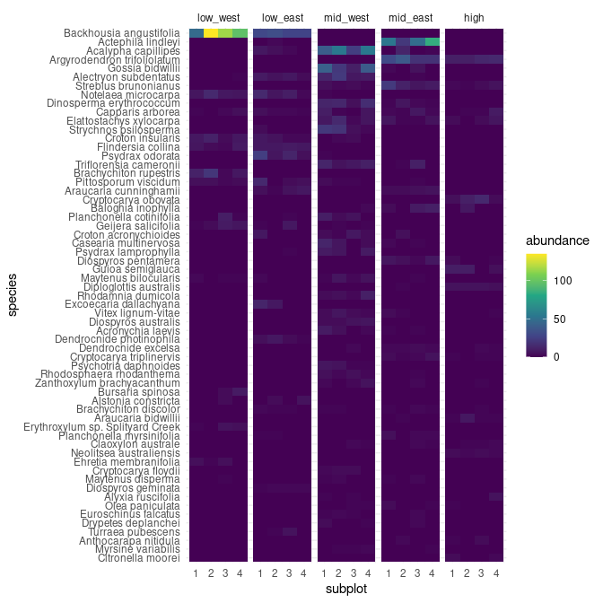
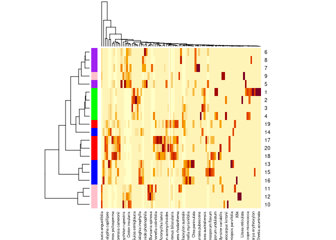
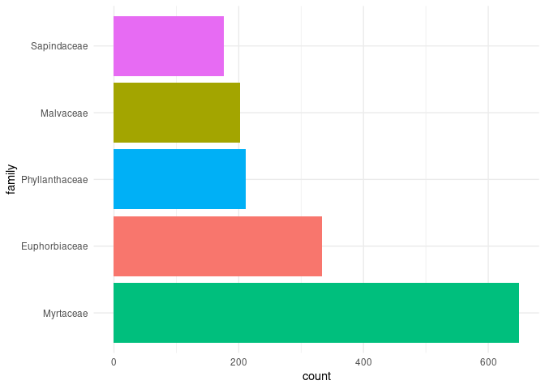
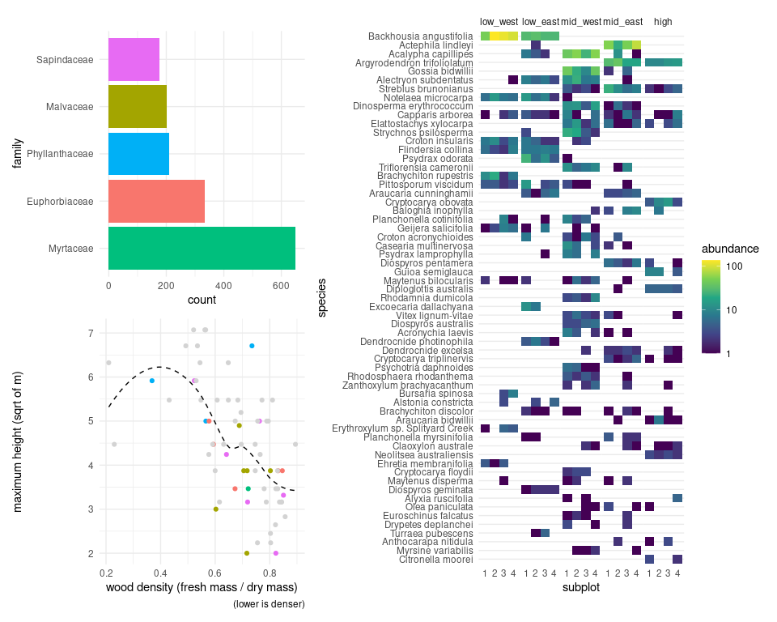
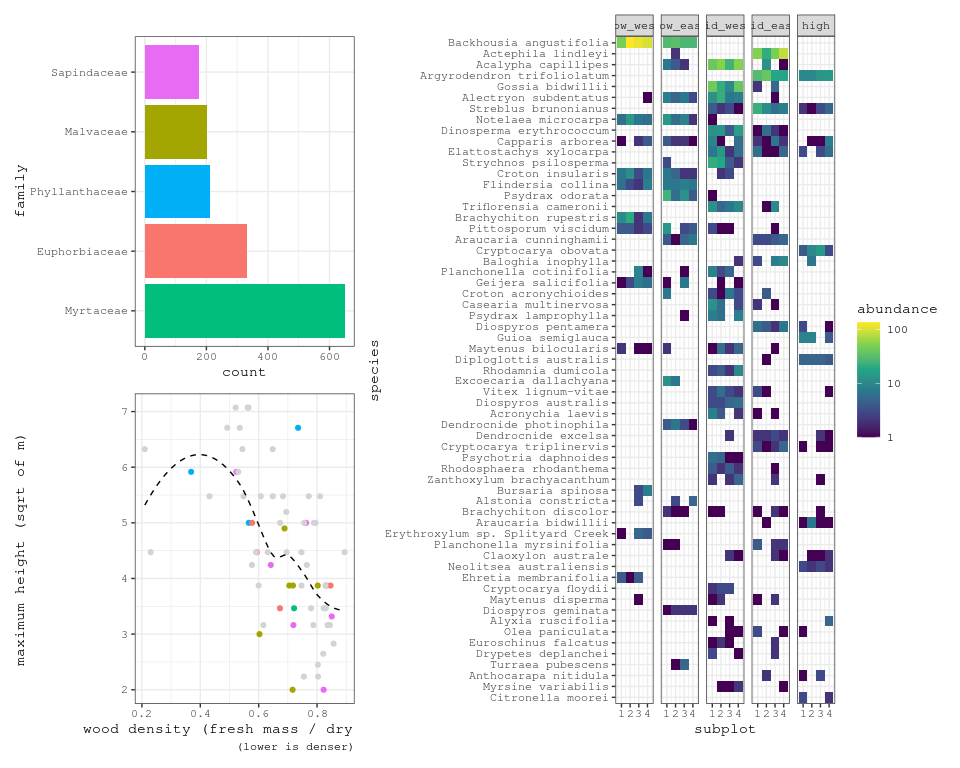

ggplot2 advanced
================
Stéphane Guillou
2022-05-20

## Refining ggplot2 visualisations

Starting with the `boilrdata` package, let’s use the `bunyas` dataset.
We will use a number of functions from the tidyverse, so let’s also load
the whole of the core Tidyverse packages.

``` r
library(boilrdata)
library(tidyverse)
```

The abundance dataset contains counts of 89 species in different
locations and different subplots.

We can visualise the data as a kind of heatmap, to try and spot the
differences in dominant species and diversity.

The first thing we need to do for a heatmap-like visualisation in
ggplot2 is reshape the data to make it tidy: the species names need to
be in a column. This can be done with the tidyr package, going from wide
format to long format with the `pivot_longer()` function. We can then
create a rudimentary grid of coloured cells with ggplot2.

``` r
bun_ab <- bunyas$abundances %>% 
  pivot_longer(-c(location, subplot),
               names_to = "species", values_to = "abundance")

bun_ab %>% 
  ggplot(aes(x = paste(location, subplot), y = species, fill = abundance)) +
  geom_tile() +
  theme_minimal()
```

<!-- -->

This is very overcrowded, the labels are very hard to read. We can focus
on a smaller subset of the data, by removing some of the least common
species. To solve the x axis issue, we can opt for splitting the
visualisation into facets:

``` r
bun_ab <- bunyas$abundances %>% 
  pivot_longer(-c(location, subplot),
               names_to = "species", values_to = "abundance") %>% 
  group_by(species) %>% 
  # filter least abundant species out
  mutate(total = sum(abundance)) %>% 
  filter(total > 4) %>% 
  ungroup()

bun_ab %>% 
  # don't combine the variables for the x axis
  ggplot(aes(x = subplot, y = species, fill = abundance)) +
  geom_tile() +
  # split into facets
  facet_grid(cols = vars(location)) +
  theme_minimal()
```

<!-- -->

Next, we can change the colour palette to distinguish values better,
sort the rows to have the overall dominant species at the top, and give
a logical ordering in the locations.

The
[viridis](https://cran.r-project.org/web/packages/viridis/vignettes/intro-to-viridis.html)
collection (5 different palettes available) is integrated into ggplot2
and attention was given to accessibility (they print well as grayscale
and can be read by people experiencing colourblindness).

For the ordering of rows and column, the forcats package provides handy
functions to force a specific order (by converting the variable to a
factor) instead of ggplot2’s default alphabetical order:

-   `fct_inorder()` to conserve the order of the original dataset
-   `fct_relevel()` to provide a custom order

``` r
bun_ab <- bunyas$abundances %>% 
  pivot_longer(-c(location, subplot),
               names_to = "species", values_to = "abundance") %>% 
  group_by(species) %>% 
  mutate(total = sum(abundance)) %>% 
  filter(total > 4) %>%
  arrange(total) %>% # order here...
  ungroup()

bun_ab %>% 
  ggplot(aes(x = subplot,
             y = fct_inorder(species), # ... and keep the order here
             fill = abundance)) +
  geom_tile() +
  scale_fill_viridis_c() +
  facet_grid(cols = vars(
    # provide custom order of levels
    fct_relevel(location,
                c("low_west", "low_east", "mid_west", "mid_east", "high")))
    ) +
  theme_minimal()
```

<!-- -->

> Note that we could do a number of things to analyse the data in a more
> adequate manner, for example using relative abundances, but we focus
> on the the visualisation here.

Finally, we can customise the labels and reduce the spacing between
facets:

``` r
bun_ab %>% 
  ggplot(aes(x = subplot,
             y = fct_inorder(species),
             fill = abundance)) +
  geom_tile() +
  scale_fill_viridis_c() +
  facet_grid(cols = vars(
    fct_relevel(location,
                c("low_west", "low_east", "mid_west", "mid_east", "high")))
    ) +
  labs(y = "species") +
  theme_minimal() +
  # reduce spacing between facets
  theme(panel.spacing = unit(0, "points"))
```

<!-- -->

However, most of the grid is coloured with the lower end of the colour
scale. This is because the distribution of the abundance values is very
skewed:

``` r
ggplot(bun_ab, aes(x = abundance)) + geom_density()
```

<!-- -->

It could be useful to log-transform the colour scale directly, which has
the added benefit of making the absence of a species more obvious. We
can do that directly in the `scale_*()` function, instead of modifying
the underlying data. We then tweak the theme’s grid to better guide the
audience between species names and coloured cells:

``` r
bun_ab %>% 
  ggplot(aes(x = subplot,
             y = fct_inorder(species),
             fill = abundance)) +
  geom_tile() +
  scale_fill_viridis_c(trans = "log10", # transform the colour scale
                       na.value = NA) + # no colour for missing data
  facet_grid(
    cols = vars(
    fct_relevel(location,
                c("low_west", "low_east", "mid_west", "mid_east", "high")))
    ) +
  labs(y = "species") +
  theme_minimal() +
  theme(panel.spacing = unit(0, "points"),
         # remove the x-axis grid
        panel.grid.major.x = element_blank(),
        panel.grid.minor.x = element_blank())
```

<!-- -->

If you want to fix the cell size ratio, a coordinate function can help.
To get a grid of squares, `coord_equal()` will use a default ratio of 1
(but you might have to deal with clipped facet labels).

### A note on heatmaps

This ggplot2 equivalent of a heatmap is lacking a very important aspect
of that specialised visualisation: the clustering and reordering of rows
and columns. When using a dedicated heatmap tool, like the base R
`heatmap()` function, the clustering and reordering is visualised by the
default inclusion of dendrograms around the grid of cells:

``` r
# prepare colours to highlight different locations
loc_colours <- c("green","purple","pink","blue","red")[as.factor(bunyas$abundances$location)]
# see the default
bunyas$abundances[,-(1:2)] %>% # remove the two first columns
  as.matrix() %>% 
  heatmap(scale = "column", # scaling in the column direction reveals highs and lows per species
          RowSideColors = loc_colours)
```

<!-- -->

The clustering of the subplots is not perfect, but different functions
can be used to more effectively compute the dissimilarity between rows
and columns.

## Patchwork

Patchwork is a useful package for combining plots, as an alternative to
the `grid()` function we have used previously.

It introduces a simple syntax, using operators to combine ggplot2
objects in one layout.

First, let’s save our heatmap as an object of class `ggplot`:

``` r
p_heat <- bun_ab %>% 
  ggplot(aes(x = subplot,
             y = fct_inorder(species),
             fill = abundance)) +
  geom_tile() +
  scale_fill_viridis_c(trans = "log10",
                       na.value = NA) +
  facet_grid(
    cols = vars(
    fct_relevel(location,
                c("low_west", "low_east", "mid_west", "mid_east", "high")))
    ) +
  labs(y = "species") +
  theme_minimal() +
  theme(panel.spacing = unit(0, "points"),
        panel.grid.major.x = element_blank(),
        panel.grid.minor.x = element_blank())
# what class of object?
class(p_heat)
```

    ## [1] "gg"     "ggplot"

`ggplot` objects contain all the building blocks of a visualisation,
which means they can be further customised by chaining more ggplot2
functions with `+`, and their internals can also be manipulated. For
example, to add an extra geometry to the plot:

``` r
p_heat + geom_text(aes(label = abundance), size = 2)
```

<!-- -->

Let’s now create two more visualisations, saved as objects.

First, a bar chart that shows only the 5 most prominent families:

``` r
# get counts of 5 most common families
top_5_fams <- bunyas$trees %>% 
  count(family, sort = TRUE) %>% 
  slice(1:5)

p_fams <- top_5_fams %>% 
  ggplot(aes(x = n,
             y = fct_inorder(family), # order bars by frequency
             fill = family)) + 
  geom_col() +
  guides(fill = "none") +
  labs(x ="count", y = "family") +
  theme_minimal()
# see it
p_fams
```

<!-- -->

And one scatterplot of wood density vs maximum height, in which we:

1.  join the family data
2.  add a column to help colour only the top 5 families, using the same
    colours as in the other plot:

``` r
# get species familes from trees dataset
fams <- bunyas$trees %>% 
  select(species, family) %>% 
  unique()

p_traits <- bunyas$traits %>% 
  left_join(fams) %>% # add families into traits dataset
  # add a column that only includes the families to highlight
  mutate(fam_col = if_else(family %in% top_5_fams$family, family, NA_character_)) %>% 
  ggplot(aes(x = wd, y = sqrt_mh)) +
  geom_point(aes(colour = fct_relevel(fam_col, top_5_fams$family))) + # same order as previous plot
  geom_smooth(linetype = "dashed", colour = "black", size = 0.5,
              se = FALSE) + # remove the confidence interval
  scale_colour_discrete(guide = "none", # bar chart will serve as a legend
                        na.value = "lightgrey") + # make other families more discrete
  labs(x = "wood density (fresh mass / dry mass)",
       y = "maximum height (sqrt of m)",
       caption = "(lower is denser)") +
  theme_minimal()
# see it
p_traits
```

<!-- -->

Finally, combine the plots in one single layout, using the patchwork
syntax:

``` r
library(patchwork)
pw <- (p_fams / p_traits) | p_heat
pw
```

<!-- -->

Note that patchwork takes care of aligning the plot areas.

Patchwork provides many tools, including the `&` operator to apply a
theme to all plots:

``` r
pw & theme_bw() & theme(text = element_text('mono'))
```

<!-- -->

Notice however that this replaces any theme customisation you might have
done previously (for example, the custom spacing and grids in the
heatmap).

Patchwork also allows annotating each plot, with tags for example:

``` r
pw + plot_annotation(tag_levels = "A")
```

<!-- -->

> How could we further improve this combination of plots? Identify
> issues or annoying details, and try to find solutions in the relevant
> functions’ documentation and online. Could we remove things? Do we
> need to add more text for it to be self-explanatory? What other
> arguments could be useful in the `plot_annotation()` function?

## Exporting

RStudio’s “Plots” panel has an export menu to save plots to file.
However, it does not offer resolution options, and using ggplot2’s
`ggsave()` function allows automating the process.

By default, it saves the latest plot (but it can also take the object to
export as an argument).

``` r
ggsave("bunyas.svg")
```

That last command saves the latest visualisation in the Scalable Vector
Graphic format, or “SVG”. This is an open vector format suitable for
further editing in applications like Inkscape or Adobe Illustrator.

For such a large layout of plots, we need larger dimensions:

``` r
ggsave("bunyas.svg", width = 28, height = 18, units = "cm")
```

## Interaction with Plotly

Plotly is a data visualisation library useful for interactive plots. It
is available for various programming languages, and the R package plotly
makes it possible to build this kind of visualisation from scratch, but
also by “translating” a `ggplot` object with the `ggplotly()` function:

``` r
library(plotly)
ggplotly(p_traits)
```

The benefit of this kind of visualisation over the static one is
on-demand information by using the cursor and revealing a tooltip of
values. By adding the aesthetic mapping of `label = species` to the code
that generated `p_traits`, we could add the species names to the tooltip
to make it even more useful. (And we could pre-process the data so we
don’t get the superfluous `fct_relevel()` code.)

## Interaction with Shiny

Shiny is a package and framework for creating web applications with R.

An application’s structure is divided in two main elements: the
**server** (what happens in the background) and the **UI** (the User
Interface, in which the user sees and interacts with the content).

In this minimal example, we want to reuse our top families bar chart and
let the user control the number of families shown.

In a single script called `app.R`, we define which packages will be
necessary:

``` r
# Load the necessary packages
library(boilrdata)
library(shiny)
library(dplyr)
library(forcats)
library(plotly)
```

Then, we define the UI, including:

-   The title
-   The page structure
-   The controls we want to expose to the user
-   The visual output

``` r
#### UI ####
ui <- fluidPage(
  # Title
  titlePanel("Top families"),
  # Sidebar with a variable selector
  sidebarLayout(
    sidebarPanel(
      sliderInput("n_fam",
                  label = "Number of families",
                  min = 1, max = 12, value = 5)
    ),
    # Show the plot
    mainPanel(
      plotlyOutput("top_bars")
    )
  )
)
```

We then define what happens on the server. The code that goes inside
`renderPlotly()` is the same code we’ve used previously for our static
visualisation, the only difference being that we make use of the user’s
input, `input$n_fam`, when slicing the dataset:

``` r
#### Server ####
server <- function(input, output) {
  
  output$top_bars <- renderPlotly({
    # get counts of 5 most common families
    top_5_fams <- bunyas$trees %>% 
      count(family, sort = TRUE) %>% 
      slice(1:input$n_fam)
    
    p_fams <- top_5_fams %>% 
      ggplot(aes(x = n,
                 y = fct_inorder(family), # order bars by frequency
                 fill = family)) + 
      geom_col() +
      guides(fill = "none") +
      labs(x ="count", y = "family") +
      theme_minimal()
    # see it
    p_fams
  })
}
```

Finally, we specify how the app should be run, using the `ui` and
`server` objects we previously defined:

``` r
#### Run the app ####
shinyApp(ui = ui, server = server)
```

If you add the extra option `options = list(display.mode = "showcase")`
to the `shinyApp()` function that starts the app, you will see how the
code that is run gets highlighted as you change the slider value This
demonstrates an important aspect of Shiny apps: their **reactivity**.
When a value changes, for example when the user interacts with an input
widget, only the section of code that depends on it will be re-run. In
our example, the input is used by the data processing and ggplot2 code
blocks and they will therefore be re-run when it changes.

## Further resources

-   A gallery of [extensions to
    ggplot2](https://exts.ggplot2.tidyverse.org/gallery/)
-   [Cédric Scherer’s “ggplot
    Wizardry”](https://www.cedricscherer.com/slides/OutlierConf2021_ggplot-wizardry.pdf),
    a showcase of refined ggplot2 visualisations
-   The book *[Interactive web-based data visualization with R, plotly,
    and shiny](https://plotly-r.com/)* by Carson Sievert
-   The documentation for both [Plotly](https://plotly.com/r/) and
    [Shiny](https://shiny.rstudio.com/)
