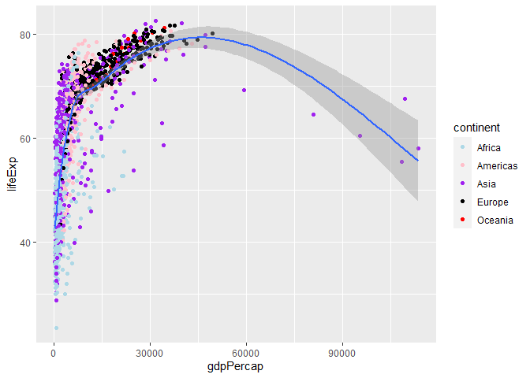
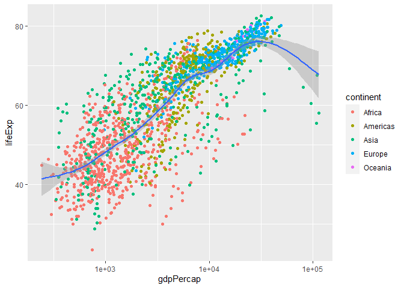
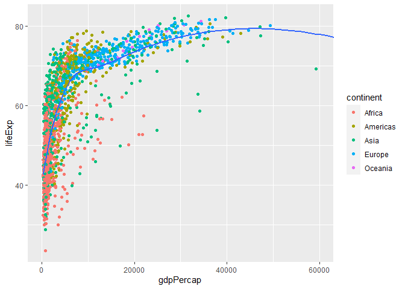
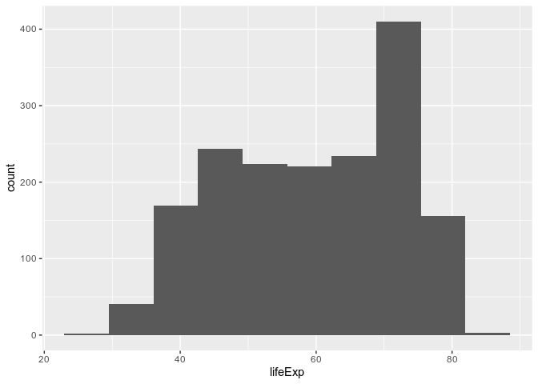
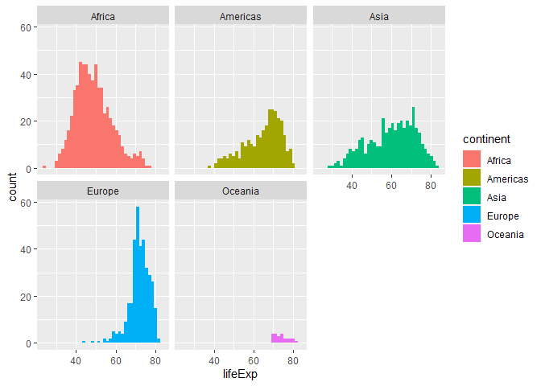
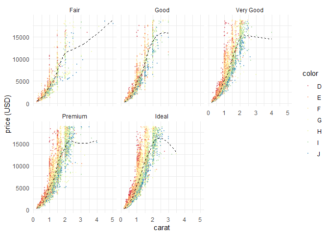

R data visualisation with RStudio and ggplot2: intermediate
================
2021-01-31

> This document is written in R Markdown, and then knitted into a
> markdown document. The source code is available at:
> <https://gitlab.com/stragu/DSH/blob/master/R/ggplot2_intermediate/ggplot2_intermediate.Rmd>  
> The published document is available at:
> <https://gitlab.com/stragu/DSH/blob/master/R/ggplot2_intermediate/ggplot2_intermediate.md>

If you need to review the installation instructions:
<https://gitlab.com/stragu/DSH/blob/master/R/Installation.md>

## Essential shortcuts

-   function or dataset help: press <kbd>F1</kbd> with your cursor
    anywhere in a function name.
-   execute from script: <kbd>Ctrl</kbd> + <kbd>Enter</kbd>
-   assignment operator (`<-`): <kbd>Alt</kbd> + <kbd>-</kbd>

## Open RStudio

On library computers:

-   Log in with your UQ username and password (use your student
    credentials if you are both staff and student)
-   Make sure you have a working internet connection
-   Go to search the magnifying glass (bottom left)
-   Open the ZENworks application
-   Look for the letter R
-   Double click on RStudio which will install both R and RStudio

If you are using your own laptop:

-   Make sure you have a working internet connection
-   Open RStudio

## Disclaimer

We will assume you are an R intermediate user and that you have used
ggplot2 before.

## What are we going to learn?

During this hands-on session, you will:

-   install a tool for picking colours
-   customise scales and ranges
-   divide a visualisation into facets
-   explore new geometries
-   modify statistical transformations
-   adjust a geometry’s position
-   further modify themes
-   make a plot interactive

## Material

### Setting up

**Install ggplot2** if you don’t already have it, with:
`install.packages("ggplot2")`

**Create a new project** to keep everything nicely contained in one
directory:

-   Click the “Create a project” button (top left cube icon)
-   Click “New Directory”
-   Click “New Project” (“Empty project” if you have an older version of
    RStudio)
-   In “Directory name”, type the name of your project,
    e.g. “ggplot2\_inter”
-   Select the folder where to locate your project:
    e.g. `Documents/RProjects`, which you can create if it doesn’t exist
    yet. You can use your H drive at UQ to make sure you can find it
    again.
-   Click the “Create Project” button

Let’s also create a “plots” folders to store exports:

``` r
dir.create("plots")
```

Create a **new script** (File &gt; New File &gt; R Script) and add a few
comments to give context:

    # Description : ggplot2 intermediate with gapminder data
    # Author: <your name>
    # Date: <today's date>

Finally, make sure you **load ggplot2** so we can use its functions:

``` r
library(ggplot2)
```

### Import data

#### Challenge 1 – import data

Our data is located at
<https://raw.githubusercontent.com/resbaz/r-novice-gapminder-files/master/data/gapminder-FiveYearData.csv>

Using the following syntax, how can you read the online CSV data into an
R object?

    gapminder <- ...

You have to use the `read.csv()` function, which can take a URL:

``` r
gapminder <- read.csv(
  file = "https://raw.githubusercontent.com/resbaz/r-novice-gapminder-files/master/data/gapminder-FiveYearData.csv")
```

If you are not familiar with the dataset, `View()` and `summary()` can
help you explore it.

``` r
View(gapminder)    # view as a separate spreadsheet
summary(gapminder) # summary statistics for each variable
```

The Environment pane gives you an overview of the variables.

### Explore data visually

Let’s start with a question: Does population grow over the years?

We can make a simple plot with the basics of ggplot2:

``` r
ggplot(data = gapminder,
       mapping = aes(x = year,
                     y = pop)) +
  geom_point()
```

<!-- -->

Remember that the 3 main elements of a ggplot2 visualisation are:

-   the *data*
-   the *mapping of aesthatics to variables*
-   the *geometry*

### Aesthetics available

So far we have been using the `x` and `y` aesthetics. There are more
available, depending on the geometry that you are using.

Here are some common examples:

-   To change the *shape* based on a variable, use
    `shape = <discrete variable>` inside the `aes()` call.
-   If you want to change the size of the geometric object, you can use
    the `size = <continuous variable>` argument.
-   Similarly, to change the *colour* based on a variable, use
    `colour = <variable>` and `fill = <variable>` inside the `aes()`
    call.

Let’s modify our plot to colour the points according to the continent
variable.

``` r
ggplot(data = gapminder,
       mapping = aes(x = year,
                     y = pop,
                     colour = continent)) +
  geom_point()
```

<!-- -->

### Modifying scales

#### More control over colours

This plot uses the default discrete palette.

> **Saving some typing**: We will keep modifying this plot. To reuse the
> constant base of our plot (the `ggplot()` call and the point
> geometry), we can create an object:

``` r
p <- ggplot(data = gapminder,
            mapping = aes(x = year,
                          y = pop,
                          colour = continent)) +
  geom_point()
```

We can use other palettes than the default one. ggplot2 provides extra
functions to modify colour scales. For example:

``` r
p +
  scale_colour_viridis_d()
```

<!-- -->
Viridis is a collection of palettes that are designed to be accessible
(i.e. perceptually uniform in colour or black and white, and perceivable
for various forms of colour blindness). The structure of the function
name is `scale_<aesthetic>_viridis_<datatype>()`, the different data
types being **d**iscrete, **c**ontinuous or **b**inned.

Another collection of palettes is the ColorBrewer collection:

``` r
p +
  scale_colour_brewer(palette = "Set1")
```

<!-- -->

You can see the palettes available by looking at the help page of
`scale_colour_brewer()`, under the header “Palettes”. However, the names
alone might not be enough to picture them, so head to
<http://colorbrewer2.org/> to find the one that you like. Importantly,
the website allows you to tick the options “colorblind safe” and “print
friendly”… which would rule out all the qualitative palettes for our 5
continents!

A useful package that introduces many palettes for ggplot2 is the
colorspace package, which promotes the [Hue-Chroma-Luminance (HCL)
colour
space](http://colorspace.r-forge.r-project.org/articles/color_spaces.html#human-color-vision-and-the-hcl-color-model-1).
This colour space is perceptually-based, which means it is particularly
suited for human perception of colours.

Let’s first use an alternative qualitative palette:

``` r
library(colorspace)
p +
  scale_colour_discrete_qualitative()
```

<!-- -->

This is the default ggplot2 palette! Which means ggplot2 already use a
HCL palette. But having the colorspace package loaded, we can now see
all the palettes available:

``` r
hcl_palettes(plot = TRUE)
```

<!-- -->

Let’s try a different one:

``` r
library(colorspace)
p +
  scale_colour_discrete_sequential("Batlow")
```

<!-- -->

For colorspace, the function names are structured as follows:
`scale_<aesthetic>_<datatype>_<colorscale>()`

Finally, to use a custom palette, we can use the ggplot2 function
`scale_colour_manual()` and provide a list of colour names.

``` r
p +
  scale_colour_manual(values = c("lightblue", "pink", "purple", "black", "red"))
```

<!-- -->

You can list all the R colour names with the function `colours()`, which
prints out a list of their names, but know that you are not limited to
these 657 values: you can also use HEX values, which is particularly
useful if you have to respect a colour scheme you were given.

You can find [visual
lists](http://www.stat.columbia.edu/~tzheng/files/Rcolor.pdf) of all the
R colours, but there is a way to pick colours more comfortably: we can
use the colourpicker package, which adds a handy addin to RStudio.
Install it and use the new “Addins &gt; Colour Picker” tool to create a
vector of colours for your custom palette.

> That was a lot of options about colours, but know that in some cases,
> the most straight-forward way to make your visualisations readable by
> most is to use symbols instead of colours. In ggplot2, you would use
> the `shape` aesthetic.

#### Axis scale modifiers

We could further modify our plot to make it more readable. For example,
we can use a different y axis scale to space out the data:

``` r
p +
  scale_y_log10()
```

<!-- -->

Our x axis is not detailed enough: we want to show the actual years
included in the dataset, rather than the automatic decades.

We can create a list of all the years when data was collected with the
`unique()` function, and modify our plot to add more breaks to our x
axis with the `scale_x_continuous()` function. How would you use them?

``` r
# list all the unique values for year
unique_years <- unique(gapminder$year)
# modify the x axis scale
p +
  scale_x_continuous(breaks = unique_years)
```

<!-- -->

We can further customise a scale with breaks and labels:

``` r
p +
  scale_x_continuous(breaks = unique_years) +
  scale_y_continuous(breaks = c(0, 100000000, 200000000, 500000000, 1000000000),
                     labels = c(0, "100 m", "200 m", "500 m", "1 b"))
```

<!-- -->

### Zooming in

To zoom in, we might want to change our axis limits by using `ylim()`.

``` r
p +
  ylim(c(0, 35e7))
```

    ## Warning: Removed 24 rows containing missing values (geom_point).

<!-- -->

Notice the warning message? ggplot2 informs us that it couldn’t display
the data related to China and India. Instead of using `ylim()`, we could
use `subset()` (or `dplyr::filter()`) to remove the two countries from
the data before feeding it to ggplot2.

The method we use works for our point geometry, but would be problematic
for other geometries that would get cut off when zooming in. A better
way to focus on one part of the plot would be to modify the **coordinate
system**:

``` r
p +
  coord_cartesian(ylim = c(0, 35e7))
```

<!-- -->

The cartesion coordinate system is the default one in ggplot2. You could
change the coordinate system to `coord_polar()` for circular
visualisations, or to `coord_map()` to visualise spatial data.

### Histograms

#### Challenge 2 – histogram of life expectancy

Search for the histogram geometry function, and plot the life
expectancy. How can we modify the bars?

``` r
ggplot(gapminder, aes(x = lifeExp)) +
  geom_histogram() # by default, bins = 30
```

    ## `stat_bin()` using `bins = 30`. Pick better value with `binwidth`.

<!-- -->

> **Saving some typing:** remember we can omit the names of the
> arguments if we write use them in order? Being explicit about the
> **argument names** is useful when learning the ins and outs of a
> function, but as you get more familiar with ggplot2, you can do away
> with the obvious ones, like `data =` and `mapping =` (as long as they
> are used in the right order!).

Let’s change the bin width:

``` r
ggplot(gapminder, aes(x = lifeExp)) +
  geom_histogram(binwidth = 15)
```

<!-- -->

We can also change the number of bins:

``` r
ggplot(gapminder, aes(x = lifeExp)) +
  geom_histogram(bins = 10)
```

<!-- -->

Now, let’s colour the bins by continent. Instinctively, you could try
the `colour` aesthetic:

``` r
ggplot(gapminder, aes(x = lifeExp, colour = continent)) +
  geom_histogram(bins = 10)
```

<!-- -->

…but it only colour the outline of the rectangles!

Some aesthetics will work better with some geometries than others. We
have to use the `fill` aesthetic to colour the areas instead:

``` r
ggplot(gapminder, aes(x = lifeExp, fill = continent)) +
  geom_histogram(bins = 10)
```

<!-- -->

Colouring our bins allows us to experiment with the geometry’s
**position**. The histogram geometry uses the “stack” position by
default. It might be more readable if we change it so it uses ratios
instead, using the `position = "fill"` argument:

``` r
ggplot(gapminder,
       aes(x = lifeExp,
           fill = continent)) +
  geom_histogram(bins = 10,
                 position = "fill")
```

<!-- -->

We can also make the bars “dodge” each other:

``` r
ggplot(gapminder,
       aes(x = lifeExp,
           fill = continent)) +
  geom_histogram(bins = 10,
                 position = "dodge")
```

<!-- -->

### Faceting

An even more readable representation could use **faceting**:

``` r
ggplot(gapminder,
       aes(x = lifeExp,
           fill = continent)) +
  geom_histogram(bins = 40) +
  facet_wrap(~ continent) 
```

<!-- -->

### Theming

The legend is probably superfluous. We want to keep the colours, but we
use the `theme()` function to customise the look of our plot:

``` r
ggplot(gapminder,
       aes(x = lifeExp,
           fill = continent)) +
  geom_histogram(bins = 40) +
  facet_wrap(~ continent) +
  theme(legend.position = "none")
```

<!-- -->

If you use a pre-built theme function, make sure you place it before
customising the legend. Otherwise it will bring the legend back!

``` r
ggplot(gapminder,
       aes(x = lifeExp,
           fill = continent)) +
  geom_histogram(bins = 40) +
  facet_wrap(~ continent) +
  theme_minimal() + # before customising the legend!
  theme(legend.position = "none")
```

<!-- -->

### A more complex facetted example

This extra example gives an idea of how a complex ggplot2 visualisation
might be constructed. It represents 4 different variables, using the
larger diamonds dataset.

``` r
ggplot(diamonds,
       aes(x = carat,
           y = price)) +
  geom_point(aes(colour = color),
             alpha = 0.5,
             size = 0.5) +
  scale_color_brewer(palette = "Spectral") +
  geom_smooth(se = FALSE,
              linetype = "dashed",
              colour = "black",
              size = 0.5) +
  facet_wrap(~cut) +
  theme_minimal() +
  labs(y = "price (USD)")
```

    ## `geom_smooth()` using method = 'gam' and formula 'y ~ s(x, bs = "cs")'

<!-- -->

### Boxplots

A simple boxplot can help visualise a distribution in categories:

``` r
ggplot(gapminder, aes(x = continent, y = lifeExp)) +
  geom_boxplot()
```

<!-- -->

#### Challenge 3 – code comprehension

What do you think this extra line might do to our boxplots?

``` r
ggplot(gapminder, aes(x = continent, y = lifeExp)) +
  geom_boxplot() +
  theme(axis.text.x = element_text(angle = 90))
```

<!-- -->

This is useful if the x labels get too cramped on the x axis: you can
rotate them to whatever angle you want.

### Make it interactive

The plotly package brings the power of the Plotly javascript library to
R. Install it with `install.packages(plotly)`, and you’ll then be able
to convert a ggplot2 visualisation in an interactive HTML visualisation
with one function!

Let’s turn our static boxplots into an interactive visualisation. First,
save our original plot as an object:

``` r
bp <- ggplot(gapminder, aes(x = continent, y = lifeExp)) +
  geom_boxplot() +
  theme(axis.text.x = element_text(angle = 90))
```

And then, feed it to the `ggplotly()` function:

``` r
library(plotly)
ggplotly(bp)
```

You can now hover over parts of your plot to reveal the corresponding
values.

### Play time!

-   Create a boxplot for each continent’s population data
    -   Colour the boxes by continent
    -   Would a violin plot do a better job at showing densities?
    -   Let’s see if you are able to move the legend to the bottom
    -   Change the general look with a built-in theme

Have a look at this [ggplot2
cheatsheet](https://www.rstudio.org/links/data_visualization_cheat_sheet)
and experiment customising your plots.

### Another example: customising a scatterplot

New research question: *How does life expectancy relate to GDP per
capita?*

This is our base plot:

``` r
ggplot(gapminder,
       aes(x = gdpPercap,
           y = lifeExp)) +
  geom_point() +
  labs(x = "GDP per capita",
       y = "Life expectancy") +
  theme_bw()
```

<!-- -->

Now, let’s make it better: spread the data with a modified **scale**,
add a **linear regression**, **colour** the continents and add some
**transparency**.

``` r
ggplot(gapminder,
       aes(x = gdpPercap,
           y = lifeExp)) +
  geom_point(aes(colour = continent),
             alpha = 0.5) +
  geom_smooth(method = "lm") +
  scale_x_log10() +
  labs(x = "GDP per capita",
       y = "Life expectancy") +
  theme_bw()
```

    ## `geom_smooth()` using formula 'y ~ x'

<!-- -->

#### Make it interactive

First, save the plot as an object:

``` r
scatter <- ggplot(gapminder,
       aes(x = gdpPercap,
           y = lifeExp,
           label = country)) + # so it appears in the tooltips
  geom_point(aes(colour = continent),
             alpha = 0.5) +
  geom_smooth(method = "lm") +
  scale_x_log10() +
  labs(x = "GDP per capita",
       y = "Life expectancy") +
  theme_bw()
```

And then, feed it to the `ggplotly()` function:

``` r
library(plotly)
ggplotly(scatter)
```

You can now identify single points, zoom into your plot, and show/hide
categories. You can even export the visualisation as a HTML page for
sharing with others.

### Close project

Closing RStudio will ask you if you want to save your workspace and
scripts. Saving your workspace is usually not recommended if you have
all the necessary commands in your script.

## Useful links

-   For ggplot2:
    -   ggplot2 cheatsheet:
        <https://www.rstudio.org/links/data_visualization_cheat_sheet>
    -   Official ggplot2 documentation:
        <http://docs.ggplot2.org/current/>
    -   Official ggplot2 website: <http://ggplot2.tidyverse.org/>
    -   Chapter on data visualisation in the book *R for Data Science*:
        <http://r4ds.had.co.nz/data-visualisation.html>
    -   from Data to Viz: <https://www.data-to-viz.com/>
    -   Selva Prabhakaran’s *r-statistics.co* section on ggplot2:
        <http://r-statistics.co/ggplot2-Tutorial-With-R.html>
    -   Coding Club’s data visualisation tutorial:
        <https://ourcodingclub.github.io/2017/01/29/datavis.html>
    -   Cookbook for R graphs: <http://www.cookbook-r.com/Graphs/>
    -   STHDA’s ggplot2 essentials:
        <http://www.sthda.com/english/wiki/ggplot2-essentials>
-   More resources for R in general:
    <https://gitlab.com/stragu/DSH/blob/master/R/usefullinks.md>
