R visualisations using ggplot2 – intermediate
================

`last revision: 2018-06-01`

> This document is written as an .Rmd document, and then knitted into a GitHub-flavoured markdown document.
> The source code is available at: <https://gitlab.com/stragu/CDS/blob/master/R/ggplot2_intermediate/ggplot2_intermediate.Rmd>
> The published document is available at: <https://gitlab.com/stragu/CDS/blob/master/R/ggplot2_intermediate/ggplot2_intermediate.md>

If you need to review the installation instructions: <https://gitlab.com/stragu/CDS/blob/master/R/Installation.md>

Keep in mind
------------

-   Case sensitive
-   No spaces in names
-   You can use <kbd>Ctrl</kbd>+<kbd>Shift</kbd> to space out your code and <kbd>Ctrl</kbd>+<kbd>Enter</kbd> to run a command.

Open RStudio
------------

-   On CDS computers:
-   Log in with your UQ username and password
-   Make sure you have a working internet connection
-   Go to search the magnifying glass (bottom left)
-   Open the ZENworks application
-   Look for the letter R
-   Double click on RStudio which will install both R and RStudio
-   Make sure you have ggplot2 installed

-   If you are using your own laptop please open RStudio
-   Make sure you have a working internet connection
-   Make sure you have ggplot2 installed

Disclaimer
----------

We will assume you are an R intermediate user and that you have used ggplot2 before.

What are we going to learn?
---------------------------

During this hands-on session, you will:

-   learn more about the layers used in ggplot2;
-   select your own colours;
-   modify aesthetics like shape and size;
-   modify scales and labels;
-   use facets;
-   experiment with new geometries;
-   learn how to modify plots quickly.

Material
--------

### Setting up

*Exercise 1 - New RStudio Project*

-   Click the "Create a project" button (top left cube icon)
-   Click "New Directory"
-   Click "New Project" ("Empty project" if you have an older version of RStudio)
-   In "Directory name", type the name of your project, e.g. "ggplot2\_inter"
-   Select the folder where to locate your project: the `Documents/RProjects` folder, which you can create if it doesn't exist yet
-   Click the "Create Project" button
-   Create two folders: "scripts" and "plots".

``` r
dir.create("scripts")
dir.create("plots")
```

*Exercise 2 - Setting up: packages and scripts*

-   Install and load the package ggplot2
-   Install only if you haven't yet done so using `install.packages("ggplot2")`
-   Load the package using:

``` r
library(ggplot2)
```

-   In the "scripts" folder create (and open) a new R script file called "gapminder\_example.R":

``` r
file.create("scripts/gapminder_example.R")  # create
file.edit("scripts/gapminder_example.R")    # open
```

Don't forget to add some comments to your header:

    # Description : create useful plots using ggplot2
    # Author: <your name>
    # Date: <today's date>

### Import data

*Exercise 3 – Read the online data into an R object*

Using the following syntax, how can you read the online CSV data into an R object?

    gapminder <- ...

You have to use the `read.csv()` function, which can take a URL:

``` r
gapminder <- read.csv(
  file = "https://raw.githubusercontent.com/resbaz/r-novice-gapminder-files/master/data/gapminder-FiveYearData.csv")
```

*Exercise 4 - Explore the dataset*

You can use `dim()`, `str()`, `head()`, `tail()` and `View()` to explore your dataset.

``` r
dim(gapminder)  # what size is the data frame?
str(gapminder)  # how is it structured?
head(gapminder) # have a look at the first few observations
tail(gapminder) # have a look at the last few observations
View(gapminder) # view as a separate spreadsheet
```

Familiarise yourself with the variable names:

``` r
colnames(gapminder)
```

    ## [1] "country"   "year"      "pop"       "continent" "lifeExp"   "gdpPercap"

### Layers used in ggplot2

Have a look at the the "Details" section of the help page:

``` r
?ggplot
```

This pseudo-code gives a general idea of how ggplot plots are constructed:

    ggplot(<data>) +
      geom_<type>(aes(x, y, fill, colour, shape, size, <more mappings>),
                  stat = <stat>,
                  position = <position>) +
      facet_<type>() +
      theme_<type>() +
      scale_<type>() +
      coord_<type>() +
      <...>

Only the *data*, the *geometry* and the *aesthetic mappings* always need to be specified.

### Explore data visually

Let's start with a question: Does population grow over the years?

We can make a simple plot with the basics of ggplot2:

``` r
ggplot(data = gapminder,
       mapping = aes(x = year,
                     y = pop)) +
  geom_point()
```

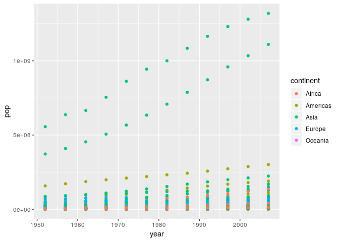

### Colour, size, shape and other aesthetic attributes

To change the *shape* based on a variable, use `shape = <discrete variable>` inside the `aes()` call.

Similarly, to change the *colour* based on a variable, use `colour = <variable>` and `fill = <variable>` inside the `aes()` call.

Finally, if you want to change the size of the geometric object, you can use the `size = <variable>` argument.

*Exercise 5 – Choosing colours*

The `colourpicker` package is a handy addin for RStudio. Install it and use the new "Addins &gt; Colour Picker" menu to pick a different colour for your geometry.

For example, to colour all the points in my geometry (regardless of data):

``` r
# install the package if you don't have it already:
# install.packages("colourpicker")
ggplot(data = gapminder,
       mapping = aes(x = year,
                     y = pop)) +
  geom_point(colour = "chartreuse3") # change the default colour
```


*Exercise 6 – Colour according to continent*

Modify your plot to colour the points according to the continent variable.

``` r
ggplot(data = gapminder,
       mapping = aes(x = year,
                     y = pop,
                     colour = continent)) +
  geom_point()
```

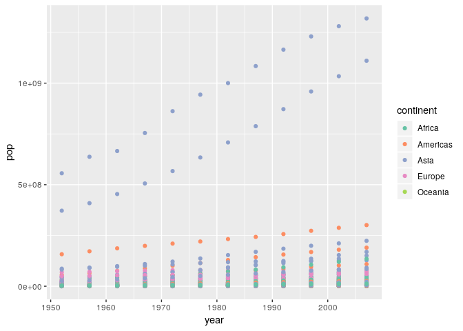

### Scales and limits

We could further modify our plot to use a different y axis scale to space out the data:

``` r
ggplot(data = gapminder,
       mapping = aes(x = year,
                     y = pop,
                     colour = continent)) +
  geom_point() +
  scale_y_log10()
```


> Being explicit about the *argument names* is useful when learning the ins and outs of a function, but as you get more familiar with ggplot2, you can do away with the obvious ones, like `data =` and `mapping =`

To reuse the constant base of our plot (the `ggplot()` call and the point geometry), we can create an object:

``` r
gg_scatter <- ggplot(gapminder,
                     aes(x = year,
                         y = pop,
                         colour = continent)) +
  geom_point()
```

*Exercise 7 - Modify the axis breaks*

Our x axis is not detailed enough.

We can create a list of all the years when data was collected with the `unique()` function, and modify our plot to add more breaks to our x axis with the `scale_x_continuous()` function. How would you use them?

``` r
# list all the unique values for year
unique_years <- unique(gapminder$year)
# modify the x axis scale
gg_scatter +
  scale_y_log10() +
  scale_x_continuous(breaks = unique_years)
```

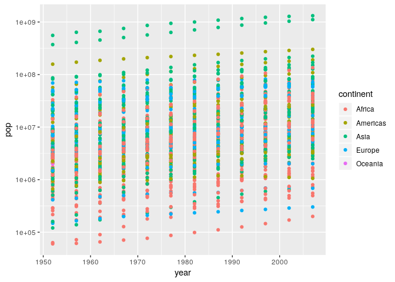

We can further customise a scale with breaks and labels:

``` r
gg_scatter +
  scale_x_continuous(breaks = unique_years) +
  scale_y_continuous(breaks = c(0, 100000000, 200000000, 500000000, 1000000000),
                     labels = c(0, "100 m", "200 m", "500 m", "1 b"))
```

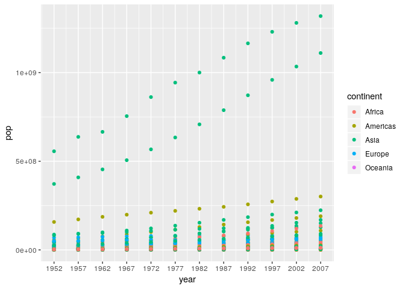

*Exercise 8 - Modify your y scale range*

To zoom in, we might want to restrict the range by using `ylim()`.

``` r
gg_scatter +
  ylim(c(0, 360000000))
```

    ## Warning: Removed 24 rows containing missing values (geom_point).

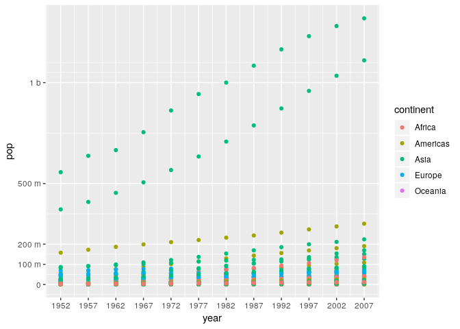

Let's talk about that warning message. We could use the `subset()` function to avoid that.

### Histograms

*Exercise 9 – Create a histogram of life expectancy*

Search for the histogram geometry function, and plot the life expectancy. How can we modify the bars?

``` r
ggplot(gapminder, aes(x = lifeExp)) +
  geom_histogram() # by default, bins = 30
```

    ## `stat_bin()` using `bins = 30`. Pick better value with `binwidth`.

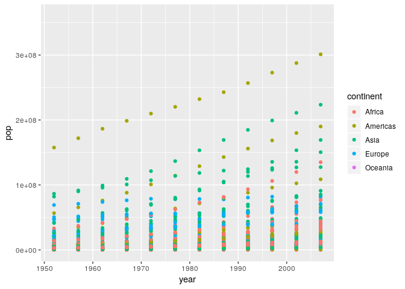

Let's change the bin width:

``` r
ggplot(gapminder, aes(x = lifeExp)) +
  geom_histogram(binwidth = 15)
```

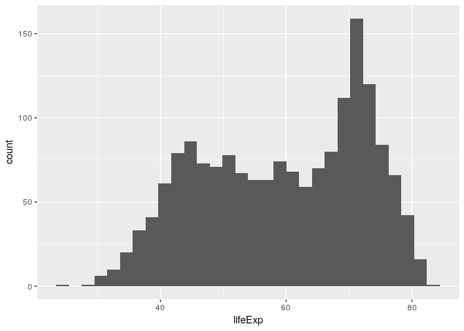

We can also change the number of bins:

``` r
ggplot(gapminder, aes(x = lifeExp)) +
  geom_histogram(bins = 10)
```

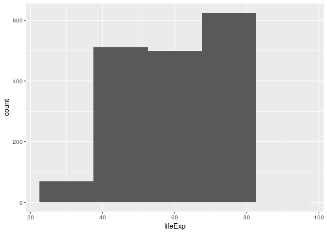

And colour by continent:

``` r
ggplot(gapminder, aes(x = lifeExp, fill = continent)) +
  geom_histogram(bins = 10)
```


The histogram geometry uses the "stack" **position** by default. It might be more readable if we change it so it uses ratios instead, using `position = "fill"` argument:

``` r
ggplot(gapminder,
       aes(x = lifeExp,
           fill = continent)) +
  geom_histogram(bins = 10,
                 position = "fill")
```


We can also make the bars "dodge"" each other:

``` r
ggplot(gapminder,
       aes(x = lifeExp,
           fill = continent)) +
  geom_histogram(bins = 10,
                 position = "dodge")
```


### Faceting

An even more readable representation could use **facetting**:

``` r
ggplot(gapminder,
       aes(x = lifeExp,
           fill = continent)) +
  geom_histogram(bins = 40) +
  facet_wrap(~ continent) 
```


### Theming

The legend is probably superfluous. We want to keep the colours, but we use the `theme()` function to customise the look of our plot:

``` r
ggplot(gapminder,
       aes(x = lifeExp,
           fill = continent)) +
  geom_histogram(bins = 40) +
  facet_wrap(~ continent) +
  theme(legend.position = "none")
```


A pre-built theme function can overwrite some defaults:

``` r
ggplot(gapminder,
       aes(x = lifeExp,
           fill = continent)) +
  geom_histogram(bins = 40) +
  facet_wrap(~ continent) +
  theme_minimal() + # before customising the legend
  theme(legend.position = "none")
```


Try other pre-built themes, like `theme_bw()` and `theme_light()`. You can also start with an empty theme thanks to `theme_void()`, and even install extras with the package `ggthemes`.

### Labels

We can make our plot better with descriptive **labels**:

``` r
ggplot(gapminder,
       aes(x = lifeExp,
           fill = continent)) +
  geom_histogram(bins = 40) +
  facet_wrap(~ continent) +
  theme_minimal() + # before customising the legend
  theme(legend.position = "none") +
  xlab("life expectancy") +
  ylab("count")
```

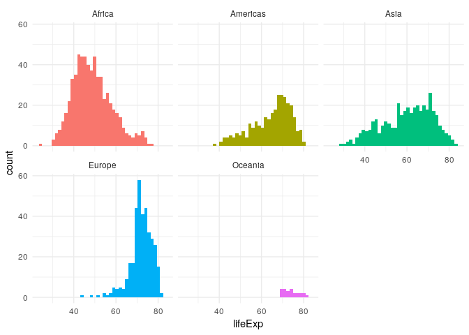

### Customise a scatterplot

New research question: *How does life expectancy relate to GDP per capita?*

``` r
ggplot(gapminder,
       aes(x = gdpPercap,
           y = lifeExp)) +
  geom_point() +
  labs(x = "GDP per capita",
       y = "Life expectancy",
       title = "How does GDP relate to life expectancy?") +
  theme_bw()
```

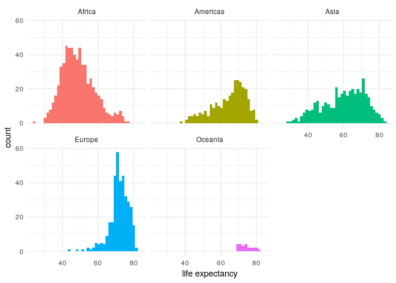

The `labs()` function allows you to group all the labels in one call.

Now, let's make it better: spread the data with a modified **scale**, add a **linear regression**, **colour** the continents and add some **transparency**.

``` r
ggplot(gapminder,
       aes(x = gdpPercap,
           y = lifeExp)) +
  geom_point(aes(colour = continent),
             alpha = 0.5) +
  geom_smooth(method = "lm") +
  scale_x_log10() +
  labs(x = "GDP per capita",
       y = "Life expectancy",
       title = "How does GDP relate to life expectancy?") +
  theme_bw()
```

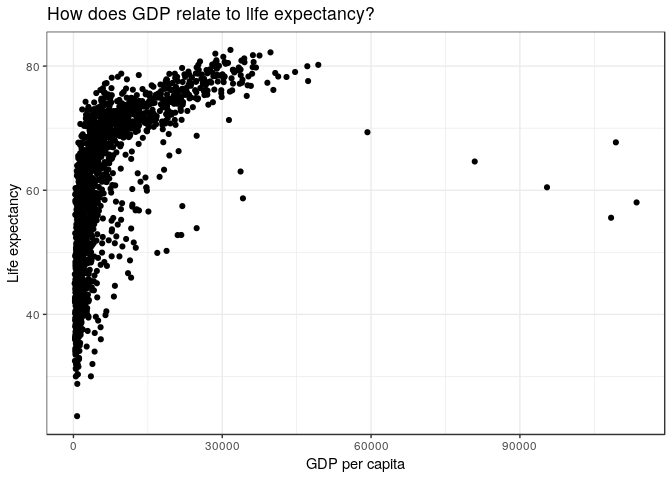

### Save your plots

To Save your plots in different formats and resolutions, use

``` r
ggsave("myplot.png", width = 7, height = 5)
```

`ggsave()` allows you to specify more parameters than RStudio's "Export" menu, and is very helpful to export visualisations that will be printed on a poster (`width` and `height` also resize the font, and `DPI` will allow a bigger resolution).

### Other geometries

To count categorical data, use `geom_bar()`:

``` r
ggplot(gapminder, aes(x = continent)) +
  geom_bar()
```


A simple boxplot to visualise distribution in categories:

``` r
ggplot(gapminder, aes(x = continent, y = lifeExp)) +
  geom_boxplot()
```

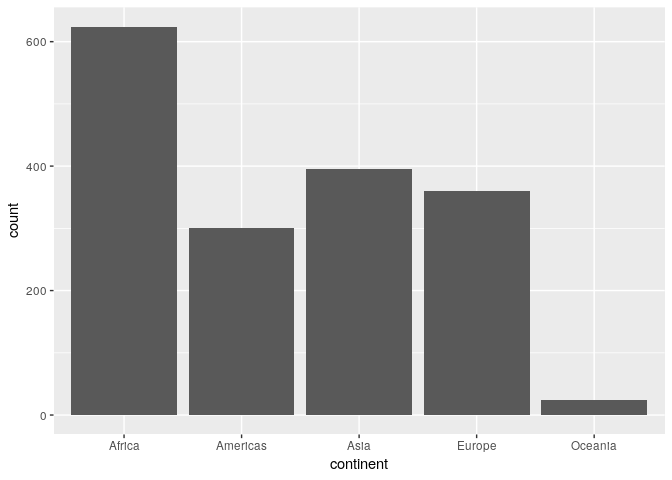

Violin plots might be better at visualising densities:

``` r
ggplot(gapminder, aes(x = continent, y = lifeExp)) +
  geom_violin()
```

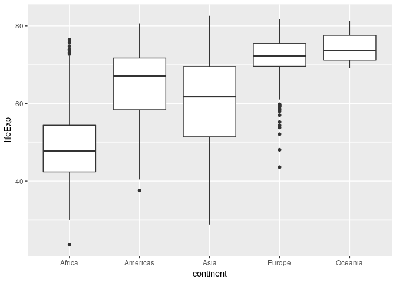

If the categories get too cramped on the axis, you can rotate them:

``` r
ggplot(gapminder, aes(x = continent, y = lifeExp)) +
  geom_violin() +
  theme(axis.text.x = element_text(angle = 90))
```

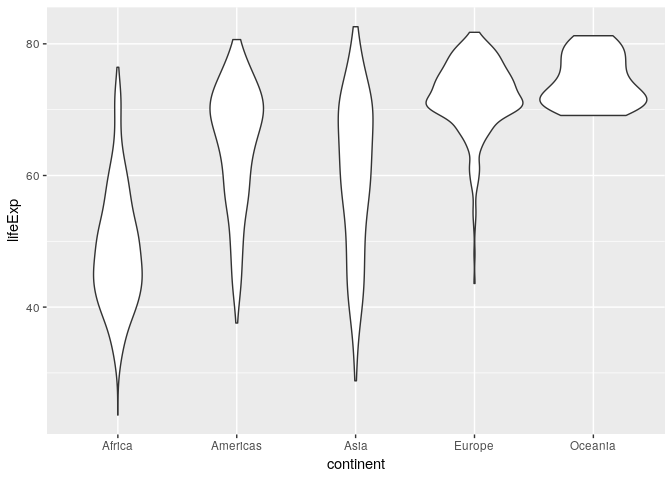

### Play time!

-   Create a a boxplot of continent vs population
    -   Colour and fill by continent
    -   try to limit the y axis to see the boxes better
    -   let's see if you are able to move the legend to the bottom

### Modify your plots

Have a look at this [ggplot2 cheatsheet](https://github.com/rstudio/cheatsheets/raw/master/data-visualization-2.1.pdf) and experiment customising your plots.

### Close RProject

Closing RStudio will ask you if you want to save your workspace and scripts.

Important links
---------------

-   For ggplot2:
    -   ggplot2 cheatsheet: <https://github.com/rstudio/cheatsheets/raw/master/data-visualization-2.1.pdf>
    -   Official ggplot2 documentation: <http://docs.ggplot2.org/current/>
    -   Official ggplot2 website: <http://ggplot2.tidyverse.org/>
    -   Chapter on data visualisation in the book *R for Data Science*: <http://r4ds.had.co.nz/data-visualisation.html>
    -   Coding Club's data visualisation tutorial: <https://ourcodingclub.github.io/2017/01/29/datavis.html>
    -   Cookbook for R graphs: <http://www.cookbook-r.com/Graphs/>
    -   STHDA's ggplot2 essentials: <http://www.sthda.com/english/wiki/ggplot2-essentials>
    -   R colours <http://www.stat.columbia.edu/~tzheng/files/Rcolor.pdf>
    -   Book: Hadley Wickham. ggplot2 Elegant Graphics for Data Analysis Second Edition. 2016 <https://link-springer-com.ezproxy.library.uq.edu.au/content/pdf/10.1007%2F978-3-319-24277-4.pdf>
-   R and RStudio in general:
    -   RStudio Cheatsheet <https://github.com/rstudio/cheatsheets/raw/master/rstudio-ide.pdf>
    -   RStudio online learning <https://www.rstudio.com/online-learning/>
    -   Basic and advanced manuals <https://cran.r-project.org/manuals.html>
    -   Ask about any function or package <http://www.rdocumentation.org/>
    -   If you are looking how-to's or how to fix an error <http://stackoverflow.com/questions/tagged/r>
    -   Lynda.com R training and tutorials <https://www.lynda.com/R-training-tutorials/1570-0.html> remember to sign in from UQ, <https://web.library.uq.edu.au/library-services/training/lyndacom-online-courses>
    -   ANOVA in R <http://homepages.inf.ed.ac.uk/bwebb/statistics/ANOVA_in_R.pdf> or <https://rcompanion.org/rcompanion/e_01.html>
    -   If you need an R and/or RStudio workshop/session, please contact the Centre for Digital Scholarship staff to organise one for you. <https://web.library.uq.edu.au/locations-hours/centre-digital-scholarship>
    -   If you have further questions about R, please contact the CDS: <cds@library.uq.edu.au>
    -   Ask questions to other researchers during the weekly Hacky Hour: <https://rcc.uq.edu.au/meetups>
    -   Contact your unit's statistician (if you have one?)
