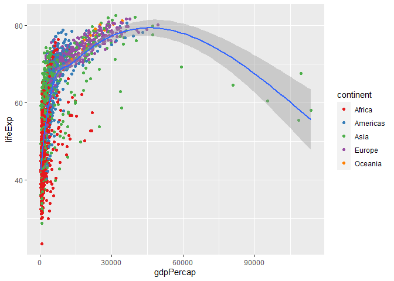
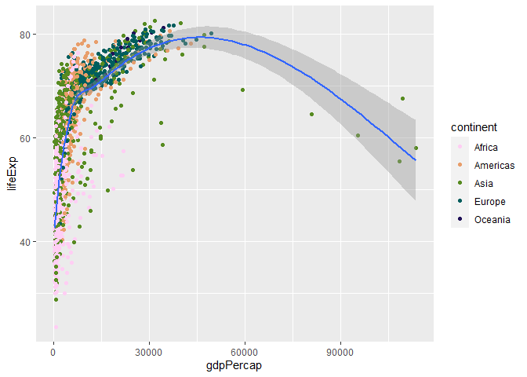
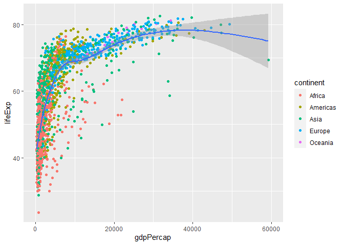
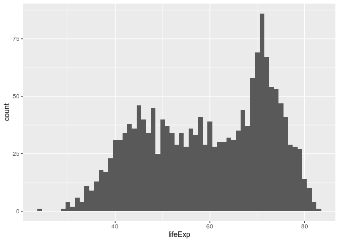
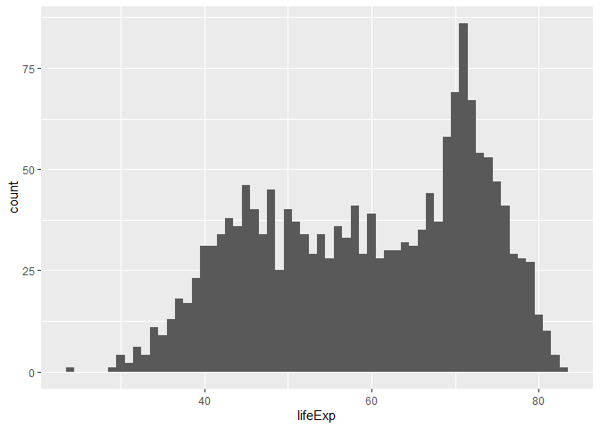
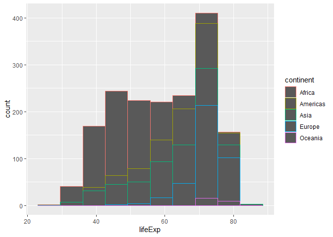
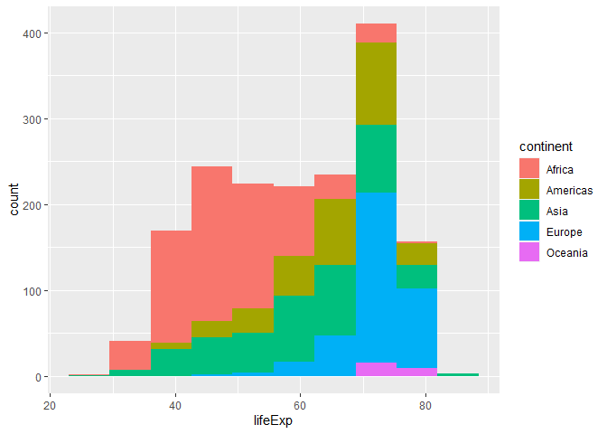

R data visualisation with RStudio and ggplot2: intermediate
================
2020-05-28

> This document is written in R Markdown, and then knitted into a
> markdown document. The source code is available at:
> <https://gitlab.com/stragu/DSH/blob/master/R/ggplot2_intermediate/ggplot2_intermediate.Rmd>  
> The published document is available at:
> <https://gitlab.com/stragu/DSH/blob/master/R/ggplot2_intermediate/ggplot2_intermediate.md>

If you need to review the installation instructions:
<https://gitlab.com/stragu/DSH/blob/master/R/Installation.md>

## Essential shortcuts

  - function or dataset help: press <kbd>F1</kbd> with your cursor
    anywhere in a function name.
  - execute from script: <kbd>Ctrl</kbd> + <kbd>Enter</kbd>
  - assignment operator (`<-`): <kbd>Alt</kbd> + <kbd>-</kbd>

## Open RStudio

On library computers:

  - Log in with your UQ username and password (use your student
    credentials if you are both staff and student)
  - Make sure you have a working internet connection
  - Go to search the magnifying glass (bottom left)
  - Open the ZENworks application
  - Look for the letter R
  - Double click on RStudio which will install both R and RStudio

If you are using your own laptop:

  - Make sure you have a working internet connection
  - Open RStudio

## Disclaimer

We will assume you are an R intermediate user and that you have used
ggplot2 before.

## What are we going to learn?

During this hands-on session, you will:

  - install a tool for picking colours
  - customise scales and ranges
  - divide a visualisation into facets
  - explore new geometries
  - modify statistical transformations
  - adjust a geometry’s position
  - further modify themes
  - make a plot interactive

## Material

### Setting up

**Install ggplot2** if you don’t already have it, with:
`install.packages("ggplot2")`

**Create a new project** to keep everything nicely contained in one
directory:

  - Click the “Create a project” button (top left cube icon)
  - Click “New Directory”
  - Click “New Project” (“Empty project” if you have an older version of
    RStudio)
  - In “Directory name”, type the name of your project,
    e.g. “ggplot2\_inter”
  - Select the folder where to locate your project:
    e.g. `Documents/RProjects`, which you can create if it doesn’t
    exist yet. You can use your H drive at UQ to make sure you can find
    it again.
  - Click the “Create Project” button

Let’s also create a “plots” folders to store exports:

``` r
dir.create("plots")
```

Create a **new script** (File \> New File \> R Script) and add a few
comments to give context:

    # Description : ggplot2 intermediate with gapminder data
    # Author: <your name>
    # Date: <today's date>

Finally, make sure you **load ggplot2** so we can use its functions:

``` r
library(ggplot2)
```

### Import data

#### Challenge 1 – import data

Our data is located at
<https://raw.githubusercontent.com/resbaz/r-novice-gapminder-files/master/data/gapminder-FiveYearData.csv>

Using the following syntax, how can you read the online CSV data into an
R object?

    gapminder <- ...

You have to use the `read.csv()` function, which can take a URL:

``` r
gapminder <- read.csv(
  file = "https://raw.githubusercontent.com/resbaz/r-novice-gapminder-files/master/data/gapminder-FiveYearData.csv")
```

If you are not familiar with the dataset, `View()` and `summary()` can
help you explore it.

``` r
View(gapminder)    # view as a separate spreadsheet
summary(gapminder) # summary statistics for each variable
```

The Environment pane gives you an overview of the variables.

### Explore data visually

Let’s start with a question: Does population grow over the years?

We can make a simple plot with the basics of ggplot2:

``` r
ggplot(data = gapminder,
       mapping = aes(x = year,
                     y = pop)) +
  geom_point()
```

<!-- -->

Remember that only the *data*, the *geometry* and the *aesthetic
mappings* always need to be specified.

### Aesthetics available

So far we have been using the `x` and `y` easthetics. There are more
available, depending on the geometry that you are using.

To change the *shape* based on a variable, use `shape = <discrete
variable>` inside the `aes()` call.

If you want to change the size of the geometric object, you can use the
`size = <continuous variable>` argument.

Similarly, to change the *colour* based on a variable, use `colour =
<variable>` and `fill = <variable>` inside the `aes()` call.

### More control over colours

Modify your plot to colour the points according to the continent
variable.

``` r
ggplot(data = gapminder,
       mapping = aes(x = year,
                     y = pop,
                     colour = continent)) +
  geom_point()
```

<!-- -->

This plot uses the default discrete palette.

> **Saving some typing**: We will keep modifying this plot. To reuse the
> constant base of our plot (the `ggplot()` call and the point
> geometry), we can create an object:

``` r
p <- ggplot(data = gapminder,
            mapping = aes(x = year,
                          y = pop,
                          colour = continent)) +
  geom_point()
```

We can use other palettes than the default one. You can see the ones
available in ggplot2 by looking at the help page of, for example,
`scale_colour_brewer()`, under the header “Palettes”.

Those are the ColorBrewer palettes, which can be explored online:
<http://colorbrewer2.org/>

If you want a visual overview of the Brewer palettes inside RStudio, you
can use a function from the RColorBrewer package (installed
automatically with ggplot2):

``` r
library(RColorBrewer)
display.brewer.all() # all palettes
```

<!-- -->

``` r
display.brewer.all(colorblindFriendly = TRUE) # only colourblind-friendly palettes
```

<!-- -->

Now, try a different palette for your continents:

``` r
p +
  scale_colour_brewer(palette = "Set2")
```

<!-- -->

Note that the ColorBrewer palettes were designed for categorical data.
If you are dealing with continuous data, you can still use the same
sequential and diverging palette names, but you will have to use the
function `scale_colour_distiller()` instead.

To use a custom palette, we can use the function `scale_colour_manual()`
and provide a list of colour names.

``` r
p +
  scale_colour_manual(values = c("blue", "red", "purple", "green", "orange"))
```

<!-- -->

You can find out about R colour names with the function `colours()`,
which prints out a list of their names, but know that you can also use
HEX values.

You can find [visual
lists](http://www.stat.columbia.edu/~tzheng/files/Rcolor.pdf) of all the
R colours, but there is a way to pick colours more comfortably: we can
use the colourpicker package, which adds a handy addin to RStudio.
Install it and use the new “Addins \> Colour Picker” window to create a
vector of colours for your custom palette.

### Scale modifiers

We could further modify our plot to make it more readable. For example,
we can use a different y axis scale to space out the data:

``` r
p +
  scale_y_log10()
```

<!-- -->

Our x axis is not detailed enough: we want to show the actual years
included in the dataset, rather than the automatic decades.

We can create a list of all the years when data was collected with the
`unique()` function, and modify our plot to add more breaks to our x
axis with the `scale_x_continuous()` function. How would you use them?

``` r
# list all the unique values for year
unique_years <- unique(gapminder$year)
# modify the x axis scale
p +
  scale_x_continuous(breaks = unique_years)
```

<!-- -->

We can further customise a scale with breaks and labels:

``` r
p +
  scale_x_continuous(breaks = unique_years) +
  scale_y_continuous(breaks = c(0, 100000000, 200000000, 500000000, 1000000000),
                     labels = c(0, "100 m", "200 m", "500 m", "1 b"))
```

<!-- -->

To zoom in, we might want to change our axis limits by using `ylim()`.

``` r
p +
  ylim(c(0, 360000000))
```

    ## Warning: Removed 24 rows containing missing values (geom_point).

<!-- -->

Notice the warning message? ggplot2 informs us that it couldn’t display
the data related to China and India. Instead of using `ylim()`, we could
use `subset()` (or `dplyr::filter()`) to remove the two countries from
the data before feeding it to gglot2.

### Histograms

#### Challenge 2 – histogram of life expectancy

Search for the histogram geometry function, and plot the life
expectancy. How can we modify the bars?

``` r
ggplot(gapminder, aes(x = lifeExp)) +
  geom_histogram() # by default, bins = 30
```

    ## `stat_bin()` using `bins = 30`. Pick better value with `binwidth`.

<!-- -->

> **Saving some typing:** remember we can omit the names of the
> arguments if we write use them in order? Being explicit about the
> **argument names** is useful when learning the ins and outs of a
> function, but as you get more familiar with ggplot2, you can do away
> with the obvious ones, like `data =` and `mapping =` (as long as they
> are used in the right order\!).

Let’s change the bin width:

``` r
ggplot(gapminder, aes(x = lifeExp)) +
  geom_histogram(binwidth = 15)
```

<!-- -->

We can also change the number of bins:

``` r
ggplot(gapminder, aes(x = lifeExp)) +
  geom_histogram(bins = 10)
```

<!-- -->

Now, let’s colour the bins by continent. Instinctively, you could try
the `colour` aesthetic:

``` r
ggplot(gapminder, aes(x = lifeExp, colour = continent)) +
  geom_histogram(bins = 10)
```

<!-- -->

…but it only colour the outline of the rectangles\!

Some aesthetics will work better with some geometries than others. We
have to use the `fill` aesthetic to colour the areas instead:

``` r
ggplot(gapminder, aes(x = lifeExp, fill = continent)) +
  geom_histogram(bins = 10)
```

<!-- -->

Colouring our bins allows us to experiment with the geometry’s
**position**. The histogram geometry uses the “stack” position by
default. It might be more readable if we change it so it uses ratios
instead, using the `position = "fill"` argument:

``` r
ggplot(gapminder,
       aes(x = lifeExp,
           fill = continent)) +
  geom_histogram(bins = 10,
                 position = "fill")
```

<!-- -->

We can also make the bars “dodge” each other:

``` r
ggplot(gapminder,
       aes(x = lifeExp,
           fill = continent)) +
  geom_histogram(bins = 10,
                 position = "dodge")
```

<!-- -->

### Faceting

An even more readable representation could use **faceting**:

``` r
ggplot(gapminder,
       aes(x = lifeExp,
           fill = continent)) +
  geom_histogram(bins = 40) +
  facet_wrap(~ continent) 
```

<!-- -->

### Theming

The legend is probably superfluous. We want to keep the colours, but we
use the `theme()` function to customise the look of our plot:

``` r
ggplot(gapminder,
       aes(x = lifeExp,
           fill = continent)) +
  geom_histogram(bins = 40) +
  facet_wrap(~ continent) +
  theme(legend.position = "none")
```

<!-- -->

If you use a pre-built theme function, make sure you place it before
customising the legend. Otherwise it will bring the legend back\!

``` r
ggplot(gapminder,
       aes(x = lifeExp,
           fill = continent)) +
  geom_histogram(bins = 40) +
  facet_wrap(~ continent) +
  theme_minimal() + # before customising the legend!
  theme(legend.position = "none")
```

<!-- -->

### A more complex facetted example

This extra example gives an idea of how a complex ggplot2 visualisation
might be constructed. It represents 4 different variables, using the
larger diamonds dataset.

``` r
ggplot(diamonds,
       aes(x = carat,
           y = price)) +
  geom_point(aes(colour = color),
             alpha = 0.5,
             size = 0.5) +
  scale_color_brewer(palette = "Spectral") +
  geom_smooth(se = FALSE,
              linetype = "dashed",
              colour = "black",
              size = 0.5) +
  facet_wrap(~cut) +
  theme_minimal() +
  labs(y = "price (USD)")
```

    ## `geom_smooth()` using method = 'gam' and formula 'y ~ s(x, bs = "cs")'

<!-- -->

### Boxplots

A simple boxplot can help visualise a distribution in categories:

``` r
ggplot(gapminder, aes(x = continent, y = lifeExp)) +
  geom_boxplot()
```

<!-- -->

#### Challenge 3 – code comprehension

What do you think this extra line might do to our violin plot?

``` r
ggplot(gapminder, aes(x = continent, y = lifeExp)) +
  geom_boxplot() +
  theme(axis.text.x = element_text(angle = 90))
```

<!-- -->

This is useful if the x labels get too cramped on the x axis: you can
rotate them to whatever angle you want.

### Make it interactive

The plotly package brings the power of the Plotly javascript library to
R. Install it with `install.packages(plotly)`, and you’ll then be able
to convert a ggplot2 visualisation in an interactive HTML visualisation
with one function\!

Let’s turn our static boxplots into an interactive visualisation. First,
save our original plot as an object:

``` r
bp <- ggplot(gapminder, aes(x = continent, y = lifeExp)) +
  geom_boxplot() +
  theme(axis.text.x = element_text(angle = 90))
```

And then, feed it to the `ggplotly()` function:

``` r
library(plotly)
```

    ## 
    ## Attaching package: 'plotly'

    ## The following object is masked from 'package:ggplot2':
    ## 
    ##     last_plot

    ## The following object is masked from 'package:stats':
    ## 
    ##     filter

    ## The following object is masked from 'package:graphics':
    ## 
    ##     layout

``` r
ggplotly(bp)
```

<!--html_preserve-->

<div id="htmlwidget-b3c82b9d020aa157037b" class="plotly html-widget" style="width:672px;height:480px;">

</div>

<script type="application/json" data-for="htmlwidget-b3c82b9d020aa157037b">{"x":{"data":[{"x":[3,3,3,3,3,3,3,3,3,3,3,3,3,3,3,3,3,3,3,3,3,3,3,3,3,3,3,3,3,3,3,3,3,3,3,3,3,3,3,3,3,3,3,3,3,3,3,3,3,3,3,3,3,3,3,3,3,3,3,3,3,3,3,3,3,3,3,3,3,3,3,3,3,3,3,3,3,3,3,3,3,3,3,3,3,3,3,3,3,3,3,3,3,3,3,3,3,3,3,3,3,3,3,3,3,3,3,3,3,3,3,3,3,3,3,3,3,3,3,3,3,3,3,3,3,3,3,3,3,3,3,3,3,3,3,3,3,3,3,3,3,3,3,3,3,3,3,3,3,3,3,3,3,3,3,3,3,3,3,3,3,3,3,3,3,3,3,3,3,3,3,3,3,3,3,3,3,3,3,3,3,3,3,3,3,3,3,3,3,3,3,3,3,3,3,3,3,3,3,3,3,3,3,3,3,3,3,3,3,3,3,3,3,3,3,3,3,3,3,3,3,3,3,3,3,3,3,3,3,3,3,3,3,3,3,3,3,3,3,3,3,3,3,3,3,3,3,3,3,3,3,3,3,3,3,3,3,3,3,3,3,3,3,3,3,3,3,3,3,3,3,3,3,3,3,3,3,3,3,3,3,3,3,3,3,3,3,3,3,3,3,3,3,3,3,3,3,3,3,3,3,3,3,3,3,3,3,3,3,3,3,3,3,3,3,3,3,3,3,3,3,3,3,3,3,3,3,3,3,3,3,3,3,3,3,3,3,3,3,3,3,3,3,3,3,3,3,3,3,3,3,3,3,3,3,3,3,3,3,3,3,3,3,3,3,3,3,3,3,3,3,3,3,3,3,3,3,3,3,3,3,3,3,3,3,3,3,3,3,3,3,3,3,3,3,3,4,4,4,4,4,4,4,4,4,4,4,4,4,4,4,4,4,4,4,4,4,4,4,4,4,4,4,4,4,4,4,4,4,4,4,4,4,4,4,4,4,4,4,4,4,4,4,4,4,4,4,4,4,4,4,4,4,4,4,4,4,4,4,4,4,4,4,4,4,4,4,4,4,4,4,4,4,4,4,4,4,4,4,4,4,4,4,4,4,4,4,4,4,4,4,4,4,4,4,4,4,4,4,4,4,4,4,4,4,4,4,4,4,4,4,4,4,4,4,4,4,4,4,4,4,4,4,4,4,4,4,4,4,4,4,4,4,4,4,4,4,4,4,4,4,4,4,4,4,4,4,4,4,4,4,4,4,4,4,4,4,4,4,4,4,4,4,4,4,4,4,4,4,4,4,4,4,4,4,4,4,4,4,4,4,4,4,4,4,4,4,4,4,4,4,4,4,4,4,4,4,4,4,4,4,4,4,4,4,4,4,4,4,4,4,4,4,4,4,4,4,4,4,4,4,4,4,4,4,4,4,4,4,4,4,4,4,4,4,4,4,4,4,4,4,4,4,4,4,4,4,4,4,4,4,4,4,4,4,4,4,4,4,4,4,4,4,4,4,4,4,4,4,4,4,4,4,4,4,4,4,4,4,4,4,4,4,4,4,4,4,4,4,4,4,4,4,4,4,4,4,4,4,4,4,4,4,4,4,4,4,4,4,4,4,4,4,4,4,4,4,4,4,4,4,4,4,4,4,4,4,4,4,4,4,4,4,4,4,4,4,4,4,4,4,4,4,4,4,4,4,4,4,4,4,4,4,4,4,4,1,1,1,1,1,1,1,1,1,1,1,1,1,1,1,1,1,1,1,1,1,1,1,1,1,1,1,1,1,1,1,1,1,1,1,1,1,1,1,1,1,1,1,1,1,1,1,1,1,1,1,1,1,1,1,1,1,1,1,1,1,1,1,1,1,1,1,1,1,1,1,1,1,1,1,1,1,1,1,1,1,1,1,1,1,1,1,1,1,1,1,1,1,1,1,1,1,1,1,1,1,1,1,1,1,1,1,1,1,1,1,1,1,1,1,1,1,1,1,1,1,1,1,1,1,1,1,1,1,1,1,1,1,1,1,1,1,1,1,1,1,1,1,1,1,1,1,1,1,1,1,1,1,1,1,1,1,1,1,1,1,1,1,1,1,1,1,1,1,1,1,1,1,1,1,1,1,1,1,1,1,1,1,1,1,1,1,1,1,1,1,1,1,1,1,1,1,1,1,1,1,1,1,1,1,1,1,1,1,1,1,1,1,1,1,1,1,1,1,1,1,1,1,1,1,1,1,1,1,1,1,1,1,1,1,1,1,1,1,1,1,1,1,1,1,1,1,1,1,1,1,1,1,1,1,1,1,1,1,1,1,1,1,1,1,1,1,1,1,1,1,1,1,1,1,1,1,1,1,1,1,1,1,1,1,1,1,1,1,1,1,1,1,1,1,1,1,1,1,1,1,1,1,1,1,1,1,1,1,1,1,1,1,1,1,1,1,1,1,1,1,1,1,1,1,1,1,1,1,1,1,1,1,1,1,1,1,1,1,1,1,1,1,1,1,1,1,1,1,1,1,1,1,1,1,1,1,1,1,1,1,1,1,1,1,1,1,1,1,1,1,1,1,1,1,1,1,1,1,1,1,1,1,1,1,1,1,1,1,1,1,1,1,1,1,1,1,1,1,1,1,1,1,1,1,1,1,1,1,1,1,1,1,1,1,1,1,1,1,1,1,1,1,1,1,1,1,1,1,1,1,1,1,1,1,1,1,1,1,1,1,1,1,1,1,1,1,1,1,1,1,1,1,1,1,1,1,1,1,1,1,1,1,1,1,1,1,1,1,1,1,1,1,1,1,1,1,1,1,1,1,1,1,1,1,1,1,1,1,1,1,1,1,1,1,1,1,1,1,1,1,1,1,1,1,1,1,1,1,1,1,1,1,1,1,1,1,1,1,1,1,1,1,1,1,1,1,1,1,1,1,1,1,1,1,1,1,1,1,1,1,1,1,1,1,1,1,1,1,1,1,1,1,1,1,1,1,1,1,1,1,1,1,1,1,1,1,1,1,1,1,1,1,1,1,1,1,1,1,1,1,1,1,1,1,1,1,1,1,1,1,1,1,1,1,1,1,1,1,1,1,1,1,1,1,1,1,1,1,1,1,1,1,1,1,1,1,1,1,1,1,1,1,1,2,2,2,2,2,2,2,2,2,2,2,2,2,2,2,2,2,2,2,2,2,2,2,2,2,2,2,2,2,2,2,2,2,2,2,2,2,2,2,2,2,2,2,2,2,2,2,2,2,2,2,2,2,2,2,2,2,2,2,2,2,2,2,2,2,2,2,2,2,2,2,2,2,2,2,2,2,2,2,2,2,2,2,2,2,2,2,2,2,2,2,2,2,2,2,2,2,2,2,2,2,2,2,2,2,2,2,2,2,2,2,2,2,2,2,2,2,2,2,2,2,2,2,2,2,2,2,2,2,2,2,2,2,2,2,2,2,2,2,2,2,2,2,2,2,2,2,2,2,2,2,2,2,2,2,2,2,2,2,2,2,2,2,2,2,2,2,2,2,2,2,2,2,2,2,2,2,2,2,2,2,2,2,2,2,2,2,2,2,2,2,2,2,2,2,2,2,2,2,2,2,2,2,2,2,2,2,2,2,2,2,2,2,2,2,2,2,2,2,2,2,2,2,2,2,2,2,2,2,2,2,2,2,2,2,2,2,2,2,2,2,2,2,2,2,2,2,2,2,2,2,2,2,2,2,2,2,2,2,2,2,2,2,2,2,2,2,2,2,2,2,2,2,2,2,2,2,2,2,2,2,2,2,2,2,2,2,2,2,2,2,2,2,2,2,2,2,2,2,2,5,5,5,5,5,5,5,5,5,5,5,5,5,5,5,5,5,5,5,5,5,5,5,5],"y":[28.801,30.332,31.997,34.02,36.088,38.438,39.854,40.822,41.674,41.763,42.129,43.828,59.461,58.811,57.046,59.545,59.489,62.094,63.87,65.421,66.099,66.983,67.926,69.292,70.265,71.028,71.993,45.248,65.39,67.84,69.39,70.75,71.63,73.06,74.45,75.6,76.93,78.269,79.696,80.745,69.249,71.527,73.053,74.143,58.5,62.4,65.2,67.5,69.39,70.59,72.16,73.4,74.26,75.25,76.99,78.4,72.028,72.961,72,73.6,37.578,40.08,43.165,46.988,63.03,65.5,68.73,71.43,73.42,75.38,77.11,78.67,79.36,80.69,82,82.603,43.158,45.669,48.126,51.629,56.528,61.134,63.739,65.869,50.939,53.832,56.923,59.923,63.3,65.593,69.052,70.75,72.601,73.925,74.795,75.635,37.484,39.348,41.216,43.453,45.252,46.923,50.009,52.819,56.018,59.412,62.013,64.062,69.978,67.727,66.662,67.297,47.453,52.681,55.292,57.716,62.612,64.766,67.123,69.81,72.244,74.647,77.045,78.623,55.565,58.033,60.47,64.624,67.712,69.343,71.309,74.174,75.19,76.156,76.904,77.588,55.928,64.75,67.65,70,40.317,75.45,76.2,60.396,63.179,65.798,67.946,42.244,69.521,48.251,51.253,53.754,55.491,57.489,60.222,61.271,63.625,65.033,66.803,61.195,64.59,66.974,48.127,51.631,56.532,60.765,64.406,44,50.54896,44.50136,58.38112,63.11888,63.96736,65.525,67.274,68.69,70.426,41.366,43.415,45.415,60.223,31.22,50.957,77.601,80,81.495,82.208,57.367,40.412,42.887,45.363,47.838,50.254,55.764,58.816,62.82,67.662,70.672,73.017,74.249,43.16,45.671,63.04,65.742,68.042,69.451,70.964,67.046,48.463,52.102,55.737,59.371,63.01,65.256,68,69.5,39.417,60.96,56.596,58.553,71.938,61.765,62.879,53.914,55.803,56.534,56.752,59.723,52.702,56.159,60.137,62.681,66.041,68.588,70.65,44.869,47.181,49.325,52.469,55.234,57.702,59.62,58.056,58.339,59.32,60.328,59.908,45.32,48.437,51.457,54.459,56.95,60.413,62.038,65.044,47.193,50.651,54.208,36.984,70.693,61.456,73.044,74.241,64.698,37.468,39.918,42.518,52.143,49.203,62.728,70.795,71.76,73.56,75.788,77.158,45.883,48.284,50.305,53.655,57.296,53.07,56.059,56.158,47.752,51.334,54.757,56.393,62.069,69.772,71.263,72.535,71.096,37.373,40.249,43.605,32.548,33.97,35.18,71.197,57.593,74.193,62.192,64.266,53.886,50.056,54.081,56.656,45.964,63.983,69.1,67.734,60.838,72.499,63.61,75.64,43.436,36.319,41.905,45.108,49.379,51.929,54.043,67.298,58.245,70.647,61.818,63.785,58.065,60.06,62.082,64.151,66.458,68.564,70.303,71.688,68.768,67.159,67.521,61.34,70.616,50.848,53.63,39.875,36.157,37.686,58.69,63.012,59.942,66.084,43.971,70.533,68.564,59.426,72.396,65.483,56.061,78.77,79.972,47.67,49.8,64.597,73.422,41.472,58.02,72.777,71.626,55.727,70.815,68.015,70.379,42.868,69.718,49.901,72.37,66.295,49.594,55.599,46.748,60.308,58.285,52.537,70.457,39.393,65.042,45.914,60.405,65.949,62.494,68.757,62.698,69.011,49.113,44.175,45.557,39.848,52.922,59.28,78.37,68.93,72,73.83,79.59,72.38,72.95,55.23,80.196,67.69,74.876,70.42,71.81,72.35,76.34,78.256,74.83,75.7,80.657,66.22,77.32,70.51,71.581,77.869,71.55,75.748,71.28,74.89,73.47,77.46,78.64,77.13,64.82,67.41,72.527,73.68,74.865,59.6,73.244,79.483,73.93,75.35,76.46,77.53,61.31,79.313,67.64,68.93,77.03,79.05,72.178,70.78,78.77,78.95,72.96,81.757,74.69,57.996,65.77,67.178,69.61,74.101,71.14,76.486,71.32,66.61,69.51,75.651,76.423,75.467,74.63,61.685,75.33,70.636,78.32,75.51,70.67,70.25,70.94,71.44,72.8,70.87,72.52,74.55,74.8,61.448,76.11,73.066,70.85,76.67,70.3,70.162,71.218,71.659,72.232,73.213,74.002,59.164,64.77,63.728,77.18,70.69,68.7,75.89,76.66,70.98,70.99,70.42,70.9,70.81,61.21,77.783,67.13,72.4,74.01,78.332,78.03,79.37,80.62,81.701,74.09,73.75,75.24,76.05,76.83,78.32,68.5,69.61,69.5,71.08,71.38,72.71,73.8,74.663,75.435,75.445,73.981,74.543,69.82,79.441,64.531,66.914,70.64,70.46,71.52,77.926,61.05,72.75,72.03,73.1,76.122,71.34,70.97,71.063,72.25,75.24,70.32,69.76,69.95,69.39,69.58,74.852,69.83,67.45,70.33,70.98,70.35,70.45,70.8,70.3,70.8,71,72.5,73.8,74.847,80.5,76.3,76.9,77.57,78.77,79.78,80.941,75.37,75.97,75.13,66.91,68.9,64.1,66.8,66.8,74.36,73.78,78.885,67.45,69.86,77.41,68,69.24,72.13,72.99,73.23,73.82,68.75,64.36,69.9,43.585,77.42,78.03,78.53,79.762,59.507,61.036,63.108,66.146,68.835,70.845,71.777,76.42,77.44,71.86,72.49,73.37,74.16,74.72,75.44,76.42,77.19,70.29,71.08,74.67,69.21,71.08,75.39,66.41,67.96,71.19,69.26,70.41,72.77,74.06,66.55,67.49,74.86,69.17,71.04,70.38,70.29,70.71,70.96,71.58,65.94,67.81,69.24,71.06,72.19,73.48,74.98,76.07,77.34,78.82,80.24,80.546,74.34,74.08,73.64,72.14,73.005,78.16,79.39,69.18,75.563,53.82,64.03,61.93,76.21,73.68,71,69.36,74.46,76.11,72.476,79.425,73.06,66.87,69.03,72.59,73.338,72.49,67.5,69.1,73.73,66.6,76.42,76.99,77.23,79.829,74.39,65.57,67.85,78.67,79.406,73.44,73.47,64.39,57.005,76.04,77.218,78.471,71.322,69.69,69.62,70.56,58.45,69.66,69.53,64.79,54.336,72.34,72.76,77.51,78.98,75.007,64.94,71.44,66.8,78.098,69.54,48.079,52.098,72.01,73.47,73.68,74.04,69.72,70.42,69.15,66.66,80.04,70.63,65.86,69.18,72.67,74.94,75.97,67.86,73.18,61.51,59.82,69.46,72.77,69.51,70.14,80.884,67.48,71.32,72.17,71.36,70.76,77.29,54.314,37.814,52.199,35.753,46.519,44.598,39.693,69.615,44.366,34.906,67.66,40.489,42.074,35.463,49.293,49.355,54.985,50.485,66.234,48.328,52.961,33.609,34.558,46.992,46.775,37.328,37.003,58.089,49.396,46.066,38.999,48.812,50.04,50.43,43.308,44.444,41.478,43.457,48.295,42.643,34.812,47.049,31.975,44.467,46.472,49.856,37.197,37.464,41.893,53.298,56.024,50.227,64.164,50.986,62.745,60.246,61.557,50.728,55.471,42.27,49.618,51.52,39.475,58.42,53.559,56.155,58.766,51.137,62.155,65.393,44.246,71.164,31.286,44.686,47.949,38.113,40.328,42.495,40.428,42.795,44.799,59.837,64.048,66.894,70.001,48.437,50.852,36.161,53.599,56.145,58.333,59.319,61.484,63.622,52.374,52.556,46.634,52.044,47.991,46.832,73.923,54.777,50.654,40.762,42.891,45.552,48.576,51.455,53.676,56.007,32.5,45.757,47.62,53.919,50.608,51.535,51.604,53.157,53.373,52.053,55.602,54.518,58.014,61.368,65.799,71.973,73.042,47.622,59.685,55.558,44.593,60.43,62.247,49.801,40.502,53.983,54.655,43.764,44.852,40.802,42.221,43.753,38.842,42.723,45.289,47.808,69.885,52.773,57.442,41.215,42.974,33.489,44.741,33.779,38.092,39.881,41.716,43.601,38.523,56.735,54.791,42.861,40.715,42.46,38.308,41.842,40.697,43.591,46.137,48.122,49.557,42.592,38.48,39.486,50.65,41.536,42.614,49.759,52.887,43.548,56.941,58.061,58.39,57.561,44.736,45.326,47.36,49.58,59.339,53.319,56.006,76.442,48.69,49.919,56.564,60.19,61.366,60.461,56.761,49.579,48.388,49.903,51.818,54.467,40.543,42.338,44.248,46.289,58.196,60.187,61.6,63.062,55.635,57.674,60.363,62.351,60.377,46.809,39.989,43.487,62.944,64.93,66.711,54.406,56.728,44.142,44.535,43.89,46.453,49.991,53.378,55.24,58.04,52.79,35.492,42.568,36.486,37.465,43.077,45.685,48.303,51.407,49.517,51.051,51.724,51.573,50.525,50.651,69.152,70.994,72.301,30.015,31.999,34,35.985,37.928,39.483,39.942,39.906,40.647,46.027,52.724,55.09,45.678,60.542,64.274,67.064,50.335,71.913,73.615,74.772,75.744,32.978,34.488,36.981,38.977,40.973,41.974,42.955,44.501,39.658,43.795,45.936,48.159,44.284,46.344,44.026,45.58,49.265,52.644,55.861,58.041,59.448,50.26,50.324,65.152,52.295,39.031,40.533,42.045,45.989,47.804,47.784,47.412,45.548,42.587,44.966,46.462,42.111,45.053,59.285,54.407,59.797,34.977,63.674,67.217,69.806,71.338,44.6,47.1,38.635,39.624,40.87,42.858,45.083,47.8,50.338,51.744,53.556,55.373,56.369,58.556,40.477,42.469,44.93,47.35,49.552,52.537,55.561,57.678,58.474,54.289,43.869,39.613,68.74,69.745,70.736,71.954,72.801,35.4,36.788,38.445,40.006,38.333,39.897,41.012,36.667,40.059,42.115,39.327,41.245,45.569,47.383,40.118,40.546,41.291,42.598,44.555,67.744,55.078,57.18,54.496,56.867,36.324,37.802,39.36,41.04,42.821,44.514,45.826,46.886,40.963,41.003,42.731,57.666,42.873,45.423,47.924,44.779,46.452,52.862,55.73,59.65,62.677,54.11,68.755,71.555,72.737,73.952,36.681,50.44,48.466,49.651,52.517,32.065,33.896,35.857,52.214,42.082,48.944,50.939,52.933,54.926,57.939,60.66,62.974,38.596,41.208,43.922,46.769,47.495,45.009,48.303,44.057,45.91,47.471,48.211,43.149,51.016,50.35,48.072,48.435,52.04,50.992,47.813,57.501,58.556,58.453,60.022,39.977,41.714,43.916,46.364,37.278,39.329,41.454,43.563,45.815,48.879,52.379,55.769,48.451,34.482,35.983,37.485,38.987,38.223,40.358,42.618,44.885,47.014,49.19,50.904,52.337,35.928,38.047,40.158,42.189,56.437,58.968,49.849,51.509,48.825,44.578,52.906,51.542,34.078,56.695,57.47,56.433,52.962,37.444,38.598,39.487,48.091,49.402,50.725,52.947,49.767,52.208,47.391,51.313,36.256,37.207,38.41,39.487,41.766,43.767,45.642,47.457,49.42,42.122,47.472,47.464,46.608,46.859,51.159,53.867,30.331,31.57,60.835,61.999,58.909,51.479,49.875,54.907,55.625,55.729,33.685,35.307,36.936,38.865,40.848,42.881,30,44.851,46.881,45.009,47.985,54.978,57.286,59.443,42.384,50.469,52.358,53.995,43.424,44.992,46.633,42.024,43.662,45.664,44.056,41.725,45.226,48.386,39.978,42.571,60.351,61.728,32.767,34.113,64.337,65.528,51.821,51.756,53.744,40.238,39.193,53.696,55.527,52.97,55.322,46.023,47.768,50.107,51.386,39.143,50.821,46.1,48.245,49.348,51.579,56.48,58.161,60.834,61.888,60.236,53.365,49.339,45.504,40.652,47.545,48.492,49.951,51.927,41.5,58.55,38.487,45.344,62.742,63.306,44.873,40.516,46.388,47.747,46.471,48.945,51.893,54.425,43,44.1,43.515,44.51,43.266,44.02,44.916,36.087,43.413,48.969,49.35,44.6,40,46.218,48.051,46.242,41.407,42.138,44.077,46.684,42.038,45.047,23.599,45,67.065,70.774,65.246,59.421,74.34,72.567,55.665,57.632,72.262,68.29,72.39,69.942,59.504,65.032,72.047,75.32,71.868,73.67,68.481,69.498,71.455,50.789,73.275,58.299,68.421,62.325,43.59,67.405,60.11,60.523,63.441,67.052,57.924,72.492,74.126,55.19,77.86,78.553,71.766,77.778,78.746,50.917,53.285,64.492,66.399,61.489,63.336,70.198,65.205,67.057,69.388,62.361,50.643,55.118,57.863,59.963,61.623,63.837,66.653,67.768,52.307,70.313,45.928,49.828,71.006,63.154,66.798,54.745,56.074,64.28,68.54,69.62,70.565,72.16,73.44,75.816,74.63,73.911,74.917,75.76,76.86,77.95,78.61,79.77,80.653,67.659,68.565,40.414,42.314,45.432,48.632,51.884,55.151,57.47,59.298,62.008,65.843,68.426,70.836,74.902,76.195,55.855,58.207,56.696,56.604,37.579,40.696,69.535,70.734,71.878,78.123,78.782,71.1,68.75,69.96,73.75,72.13,72.88,74.21,48.041,50.924,53.884,57.402,60.909,62.485,64.399,65.142,65.634,58.53,62.61,65.61,67.51,69,70.11,71.21,71.77,67.456,68.557,70.19,71.15,72.146,72.766,73.747,71.682,72.889,53.459,56.751,78.273,46.243,48.042,49.923,51.461,53.636,55.089,56.671,58.137,60.916,41.912,44.665,58.796,61.31,64.342,67.231,69.613,72.312,74.173,74.994,72.462,73.738,74.712,75.537,62.649,63.196,64.361,64.951,65.815,66.353,66.874,67.378,45.262,48.57,57.206,60.026,62.842,65.424,67.849,70.75,73.45,74.752,75.713,77.26,64.134,66.458,68.386,69.906,71.421,71.3,58.137,60.782,63.373,66.322,68.978,70.259,68.468,68.673,69.481,70.805,71.918,72.752,41.89,43.428,45.032,46.714,50.023,53.859,57.251,59.957,62.05,63.883,65.554,72.899,70.723,72.649,73.717,74.174,74.414,76.151,77.158,68.44,69.49,70.21,70.76,71.34,73.38,74.65,75.02,76.09,76.81,77.31,78.242,66.071,67.044,68.253,61.817,64.071,66.216,68.681,70.472,71.523,74.223,75.307,76.384,55.088,57.907,60.77,63.479,65.712,69.862,69.465,68.976,69.819,68.225,69.4,70.755,71.752,43.902,46.263,49.096,51.445,59.631,61.788,63.727,66.046,68.457,69.957,70.847,72.235,48.357,51.356,54.64,56.678,55.191,59.201,69.582,58.447,61.406,42.023,44.142,46.954,59.1,61.8,64.9,65.4,65.9,68.3,68.832,55.448,50.016,53.738,56.029,74.32,80.204,76.33,77.55,79.11,77.56,78.83,80.37,81.235,73.84,69.12,70.33,70.93,71.1,71.93,73.49,74.74,76.32,69.39,70.26,71.24,71.52,71.89,72.22],"hoverinfo":"y","type":"box","fillcolor":"rgba(255,255,255,1)","marker":{"opacity":null,"outliercolor":"rgba(0,0,0,1)","line":{"width":1.88976377952756,"color":"rgba(0,0,0,1)"},"size":5.66929133858268},"line":{"color":"rgba(51,51,51,1)","width":1.88976377952756},"showlegend":false,"xaxis":"x","yaxis":"y","frame":null}],"layout":{"margin":{"t":26.2283105022831,"r":7.30593607305936,"b":75.2511415525114,"l":37.2602739726027},"plot_bgcolor":"rgba(235,235,235,1)","paper_bgcolor":"rgba(255,255,255,1)","font":{"color":"rgba(0,0,0,1)","family":"","size":14.6118721461187},"xaxis":{"domain":[0,1],"automargin":true,"type":"linear","autorange":false,"range":[0.4,5.6],"tickmode":"array","ticktext":["Africa","Americas","Asia","Europe","Oceania"],"tickvals":[1,2,3,4,5],"categoryorder":"array","categoryarray":["Africa","Americas","Asia","Europe","Oceania"],"nticks":null,"ticks":"outside","tickcolor":"rgba(51,51,51,1)","ticklen":3.65296803652968,"tickwidth":0.66417600664176,"showticklabels":true,"tickfont":{"color":"rgba(77,77,77,1)","family":"","size":11.689497716895},"tickangle":-90,"showline":false,"linecolor":null,"linewidth":0,"showgrid":true,"gridcolor":"rgba(255,255,255,1)","gridwidth":0.66417600664176,"zeroline":false,"anchor":"y","title":{"text":"continent","font":{"color":"rgba(0,0,0,1)","family":"","size":14.6118721461187}},"hoverformat":".2f"},"yaxis":{"domain":[0,1],"automargin":true,"type":"linear","autorange":false,"range":[20.6488,85.5532],"tickmode":"array","ticktext":["40","60","80"],"tickvals":[40,60,80],"categoryorder":"array","categoryarray":["40","60","80"],"nticks":null,"ticks":"outside","tickcolor":"rgba(51,51,51,1)","ticklen":3.65296803652968,"tickwidth":0.66417600664176,"showticklabels":true,"tickfont":{"color":"rgba(77,77,77,1)","family":"","size":11.689497716895},"tickangle":-0,"showline":false,"linecolor":null,"linewidth":0,"showgrid":true,"gridcolor":"rgba(255,255,255,1)","gridwidth":0.66417600664176,"zeroline":false,"anchor":"x","title":{"text":"lifeExp","font":{"color":"rgba(0,0,0,1)","family":"","size":14.6118721461187}},"hoverformat":".2f"},"shapes":[{"type":"rect","fillcolor":null,"line":{"color":null,"width":0,"linetype":[]},"yref":"paper","xref":"paper","x0":0,"x1":1,"y0":0,"y1":1}],"showlegend":false,"legend":{"bgcolor":"rgba(255,255,255,1)","bordercolor":"transparent","borderwidth":1.88976377952756,"font":{"color":"rgba(0,0,0,1)","family":"","size":11.689497716895}},"hovermode":"closest","barmode":"relative"},"config":{"doubleClick":"reset","showSendToCloud":false},"source":"A","attrs":{"6bdd483a618b":{"x":{},"y":{},"type":"box"}},"cur_data":"6bdd483a618b","visdat":{"6bdd483a618b":["function (y) ","x"]},"highlight":{"on":"plotly_click","persistent":false,"dynamic":false,"selectize":false,"opacityDim":0.2,"selected":{"opacity":1},"debounce":0},"shinyEvents":["plotly_hover","plotly_click","plotly_selected","plotly_relayout","plotly_brushed","plotly_brushing","plotly_clickannotation","plotly_doubleclick","plotly_deselect","plotly_afterplot","plotly_sunburstclick"],"base_url":"https://plot.ly"},"evals":[],"jsHooks":[]}</script>

<!--/html_preserve-->

You can now hover over parts of your plot to reveal the corresponding
values.

### Play time\!

  - Create a boxplot for each continent’s population data
      - Colour the boxes by continent
      - Try to limit the y axis to see the boxes better
      - Let’s see if you are able to move the legend to the bottom
      - Change the general look with a built-in theme

Have a look at this [ggplot2
cheatsheet](https://www.rstudio.org/links/data_visualization_cheat_sheet)
and experiment customising your plots.

### Another example: customising a scatterplot

New research question: *How does life expectancy relate to GDP per
capita?*

This is our base plot:

``` r
ggplot(gapminder,
       aes(x = gdpPercap,
           y = lifeExp)) +
  geom_point() +
  labs(x = "GDP per capita",
       y = "Life expectancy") +
  theme_bw()
```

<!-- -->

Now, let’s make it better: spread the data with a modified **scale**,
add a **linear regression**, **colour** the continents and add some
**transparency**.

``` r
ggplot(gapminder,
       aes(x = gdpPercap,
           y = lifeExp)) +
  geom_point(aes(colour = continent),
             alpha = 0.5) +
  geom_smooth(method = "lm") +
  scale_x_log10() +
  labs(x = "GDP per capita",
       y = "Life expectancy") +
  theme_bw()
```

    ## `geom_smooth()` using formula 'y ~ x'

<!-- -->

#### Make it interactive

First, save the plot as an object:

``` r
scatter <- ggplot(gapminder,
       aes(x = gdpPercap,
           y = lifeExp,
           label = country)) + # so it appears in the tooltips
  geom_point(aes(colour = continent),
             alpha = 0.5) +
  geom_smooth(method = "lm") +
  scale_x_log10() +
  labs(x = "GDP per capita",
       y = "Life expectancy") +
  theme_bw()
```

And then, feed it to the `ggplotly()` function:

``` r
library(plotly)
ggplotly(scatter)
```

You can now identify single points, zoom into your plot, and show/hide
categories. You can even export the visualisation as a HTML page for
sharing with others.

### Close project

Closing RStudio will ask you if you want to save your workspace and
scripts. Saving your workspace is usually not recommended if you have
all the necessary commands in your script.

## Useful links

  - For ggplot2:
      - ggplot2 cheatsheet:
        <https://www.rstudio.org/links/data_visualization_cheat_sheet>
      - Official ggplot2 documentation:
        <http://docs.ggplot2.org/current/>
      - Official ggplot2 website: <http://ggplot2.tidyverse.org/>
      - Chapter on data visualisation in the book *R for Data Science*:
        <http://r4ds.had.co.nz/data-visualisation.html>
      - from Data to Viz: <https://www.data-to-viz.com/>
      - Selva Prabhakaran’s *r-statistics.co* section on ggplot2:
        <http://r-statistics.co/ggplot2-Tutorial-With-R.html>
      - Coding Club’s data visualisation tutorial:
        <https://ourcodingclub.github.io/2017/01/29/datavis.html>
      - Cookbook for R graphs: <http://www.cookbook-r.com/Graphs/>
      - STHDA’s ggplot2 essentials:
        <http://www.sthda.com/english/wiki/ggplot2-essentials>
  - More ressources for R in general:
    <https://gitlab.com/stragu/DSH/blob/master/R/usefullinks.md>
