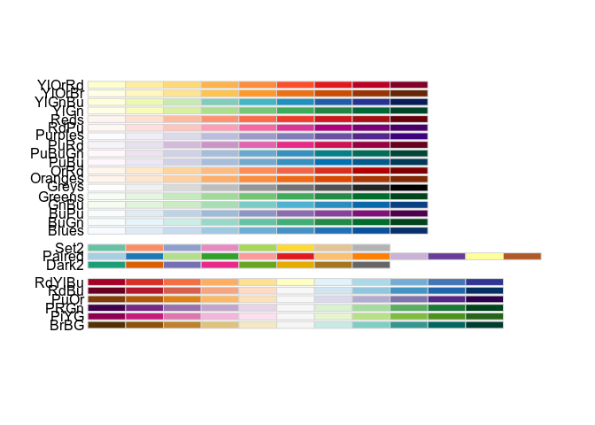
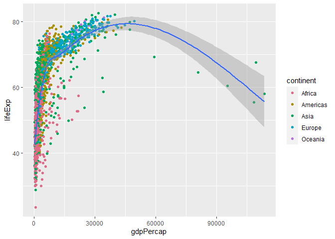
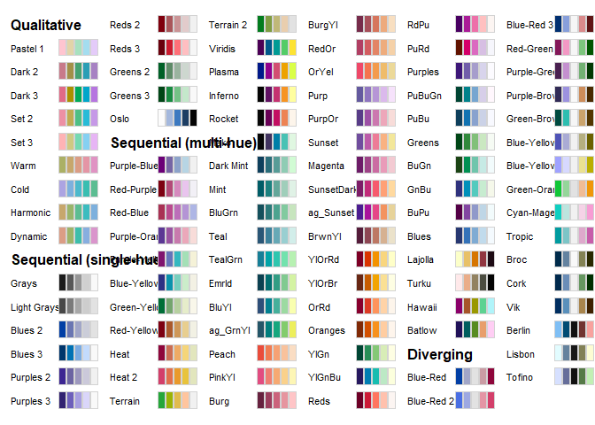
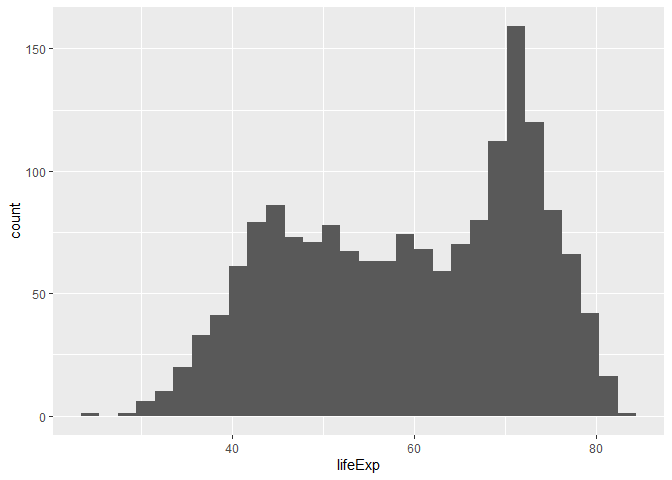
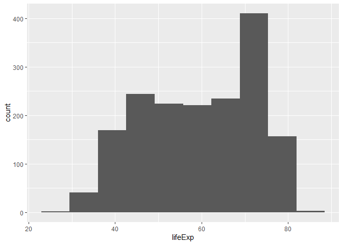
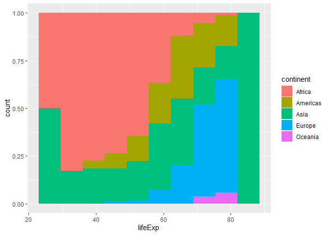
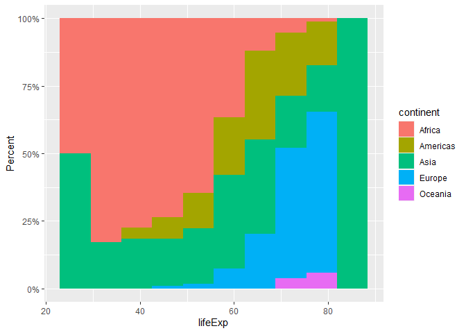
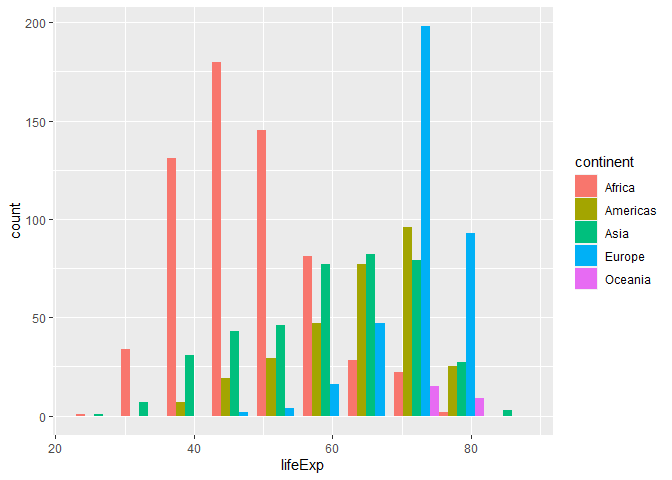
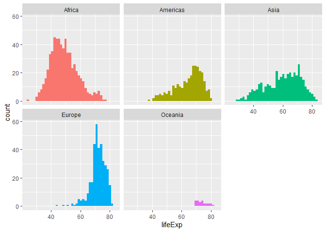

R data visualisation with RStudio and ggplot2: intermediate
================
2019-05-09

> This document is written as an .Rmd document, and then knitted into a
> GitHub-flavoured markdown document. The source code is available at:
> <https://gitlab.com/stragu/DSH/blob/master/R/ggplot2_intermediate/ggplot2_intermediate.Rmd>  
> The published document is available at:
> <https://gitlab.com/stragu/DSH/blob/master/R/ggplot2_intermediate/ggplot2_intermediate.md>

If you need to review the installation instructions:
<https://gitlab.com/stragu/DSH/blob/master/R/Installation.md>

## Essential shortcuts

  - function or dataset help: press <kbd>F1</kbd> with your cursor
    anywhere in a function name.
  - execute from script: <kbd>Ctrl</kbd> + <kbd>Enter</kbd>
  - assignment operator (`<-`): <kbd>Alt</kbd> + <kbd>-</kbd>

## Open RStudio

On library computers:

  - Log in with your UQ username and password (use your student
    credentials if you are both staff and student)
  - Make sure you have a working internet connection
  - Go to search the magnifying glass (bottom left)
  - Open the ZENworks application
  - Look for the letter R
  - Double click on RStudio which will install both R and RStudio

If you are using your own laptop:

  - Make sure you have a working internet connection
  - Open RStudio

## Disclaimer

We will assume you are an R intermediate user and that you have used
ggplot2 before.

## What are we going to learn?

During this hands-on session, you will:

  - install a tool for picking colours
  - customise scales and ranges
  - divide a visualisation into facets
  - explore new geometries
  - modify statistical transformations
  - adjust a geometry’s position
  - further modify themes

## Material

### Setting up

We’ll first create a new project to keep everything nicely contained in
one directory:

  - Click the “Create a project” button (top left cube icon)
  - Click “New Directory”
  - Click “New Project” (“Empty project” if you have an older version of
    RStudio)
  - In “Directory name”, type the name of your project, e.g.
    “ggplot2\_inter”
  - Select the folder where to locate your project: e.g.
    `Documents/RProjects`, which you can create if it doesn’t exist yet.
    You can use your H drive at UQ to make sure you can find it again.
  - Click the “Create Project” button

Let’s also create a “plots” folders to store exports:

``` r
dir.create("plots")
```

**Install ggplot2** if you don’t already have it, with:
`install.packages("ggplot2")`

Create a new script (File \> New File \> R Script) and add a few
comments to give context:

    # Description : ggplot2 intermediate with gapminder data
    # Author: <your name>
    # Date: <today's date>

Finally, make sure you **load ggplot2** so we can use its functions:

``` r
library(ggplot2)
```

    ## Registered S3 methods overwritten by 'ggplot2':
    ##   method         from 
    ##   [.quosures     rlang
    ##   c.quosures     rlang
    ##   print.quosures rlang

### Import data

#### Challenge 1 – import data

Our data is located at
<https://raw.githubusercontent.com/resbaz/r-novice-gapminder-files/master/data/gapminder-FiveYearData.csv>

Using the following syntax, how can you read the online CSV data into an
R object?

    gapminder <- ...

You have to use the `read.csv()` function, which can take a URL:

``` r
gapminder <- read.csv(
  file = "https://raw.githubusercontent.com/resbaz/r-novice-gapminder-files/master/data/gapminder-FiveYearData.csv")
```

If you are not familiar with the dataset, `View()` and `summary()` can
help you explore it.

``` r
View(gapminder)    # view as a separate spreadsheet
summary(gapminder) # summary statistics for each variable
```

The Environment pane gives you an overview of the variables.

### Explore data visually

Let’s start with a question: Does population grow over the years?

We can make a simple plot with the basics of ggplot2:

``` r
ggplot(data = gapminder,
       mapping = aes(x = year,
                     y = pop)) +
  geom_point()
```

<!-- -->

Remember that only the *data*, the *geometry* and the *aesthetic
mappings* always need to be specified.

### Aesthetics available

So far we have been using the `x` and `y` easthetics. There are more
available, depending on the geometry that you are using.

To change the *shape* based on a variable, use `shape = <discrete
variable>` inside the `aes()` call.

If you want to change the size of the geometric object, you can use the
`size = <continuous variable>` argument.

Similarly, to change the *colour* based on a variable, use `colour =
<variable>` and `fill = <variable>` inside the `aes()` call.

### More control over colours

Modify your plot to colour the points according to the continent
variable.

``` r
ggplot(data = gapminder,
       mapping = aes(x = year,
                     y = pop,
                     colour = continent)) +
  geom_point()
```

<!-- -->

This plot uses the default discrete palette.

We can use other palettes. You can see the ones available in ggplot2 by
looking at the help page of, for example, `scale_colour_brewer()`, under
the header “Palettes”.

Those are the ColorBrewer palettes, which can be explored online:
<http://colorbrewer2.org/>

If you want a visual overview of the Brewer palettes inside RStudio,
install the RColorBrewer package and try the following functions:

``` r
library(RColorBrewer)
display.brewer.all() # all palettes
```

<!-- -->

``` r
display.brewer.all(colorblindFriendly = TRUE) # only colourblind-friendly palettes
```

<!-- -->

Now, try a different palette for your continents:

``` r
ggplot(data = gapminder,
       mapping = aes(x = year,
                     y = pop,
                     colour = continent)) +
  geom_point() +
  scale_colour_brewer(palette = "Set2")
```

<!-- -->

> **Saving some typing**: To reuse the constant base of our plot (the
> `ggplot()` call and the point geometry), we can create an object:

``` r
p <- ggplot(data = gapminder,
            mapping = aes(x = year,
                          y = pop,
                          colour = continent)) +
  geom_point()
```

To use a custom palette, we can use the function `scale_colour_manual()`
and provide a list of colour names.

``` r
p +
  scale_colour_manual(values = c("blue", "red", "purple", "green", "orange"))
```

<!-- -->

You can find out about R colour names with the function `colours()`,
which prints out a list of their names, but know that you can also use
HEX values.

You can find [visual
lists](http://www.stat.columbia.edu/~tzheng/files/Rcolor.pdf) of all the
R colours, but there is a way to pick colours more comfortably: we can
use the colourpicker package, which adds a handy addin to RStudio.
Install it and use the new “Addins \> Colour Picker” window to create a
vector of colours for your custom palette.

### Scale modifiers

We could further modify our plot to make it more readable. For example,
we can use a different y axis scale to space out the data:

``` r
p +
  scale_y_log10()
```

<!-- -->

Our x axis is not detailed enough: we want to show the actual years
included in the dataset, rather than the automatic decades.

We can create a list of all the years when data was collected with the
`unique()` function, and modify our plot to add more breaks to our x
axis with the `scale_x_continuous()` function. How would you use them?

``` r
# list all the unique values for year
unique_years <- unique(gapminder$year)
# modify the x axis scale
p +
  scale_x_continuous(breaks = unique_years)
```

<!-- -->

We can further customise a scale with breaks and labels:

``` r
p +
  scale_x_continuous(breaks = unique_years) +
  scale_y_continuous(breaks = c(0, 100000000, 200000000, 500000000, 1000000000),
                     labels = c(0, "100 m", "200 m", "500 m", "1 b"))
```

<!-- -->

To zoom in, we might want to change our axis limits by using `ylim()`.

``` r
p +
  ylim(c(0, 360000000))
```

    ## Warning: Removed 24 rows containing missing values (geom_point).

<!-- -->

Let’s talk about that warning message. We could use the `subset()`
function to avoid that.

> **Saving some typing:** Being explicit about the **argument names** is
> useful when learning the ins and outs of a function, but as you get
> more familiar with ggplot2, you can do away with the obvious ones,
> like `data =` and `mapping =` (as long as they are used in the right
> order\!).

### Histograms

#### Challenge 2 – histogram of life expectancy

Search for the histogram geometry function, and plot the life
expectancy. How can we modify the bars?

``` r
ggplot(gapminder, aes(x = lifeExp)) +
  geom_histogram() # by default, bins = 30
```

    ## `stat_bin()` using `bins = 30`. Pick better value with `binwidth`.

<!-- -->

Let’s change the bin width:

``` r
ggplot(gapminder, aes(x = lifeExp)) +
  geom_histogram(binwidth = 15)
```

<!-- -->

We can also change the number of bins:

``` r
ggplot(gapminder, aes(x = lifeExp)) +
  geom_histogram(bins = 10)
```

<!-- -->

Now, let’s colour the bins by continent. We have to use the `fill`
aesthetic to colour the areas rather than the outlines:

``` r
ggplot(gapminder, aes(x = lifeExp, fill = continent)) +
  geom_histogram(bins = 10)
```

<!-- -->

Colouring our bins allows us to experiment with the geometry’s
**position**. The histogram geometry uses the “stack” position by
default. It might be more readable if we change it so it uses ratios
instead, using the `position = "fill"` argument:

``` r
ggplot(gapminder,
       aes(x = lifeExp,
           fill = continent)) +
  geom_histogram(bins = 10,
                 position = "fill")
```

<!-- -->

We can also make the bars “dodge” each other:

``` r
ggplot(gapminder,
       aes(x = lifeExp,
           fill = continent)) +
  geom_histogram(bins = 10,
                 position = "dodge")
```

<!-- -->

### Faceting

An even more readable representation could use **faceting**:

``` r
ggplot(gapminder,
       aes(x = lifeExp,
           fill = continent)) +
  geom_histogram(bins = 40) +
  facet_wrap(~ continent) 
```

<!-- -->

### Theming

The legend is probably superfluous. We want to keep the colours, but we
use the `theme()` function to customise the look of our plot:

``` r
ggplot(gapminder,
       aes(x = lifeExp,
           fill = continent)) +
  geom_histogram(bins = 40) +
  facet_wrap(~ continent) +
  theme(legend.position = "none")
```

<!-- -->

A pre-built theme function can overwrite some defaults:

``` r
ggplot(gapminder,
       aes(x = lifeExp,
           fill = continent)) +
  geom_histogram(bins = 40) +
  facet_wrap(~ continent) +
  theme_minimal() + # before customising the legend!
  theme(legend.position = "none")
```

<!-- -->

Try other pre-built themes, like `theme_bw()` and `theme_classic()`. You
can also start with an empty theme thanks to `theme_void()`, and even
install extras with the package `ggthemes`.

### Labels

We can make our plot better with descriptive **labels**:

``` r
ggplot(gapminder,
       aes(x = lifeExp,
           fill = continent)) +
  geom_histogram(bins = 40) +
  facet_wrap(~ continent) +
  theme_minimal() + # before customising the legend
  theme(legend.position = "none") +
  xlab("Life expectancy") +
  ylab("Count")
```

<!-- -->

### Customise a scatterplot

New research question: *How does life expectancy relate to GDP per
capita?*

``` r
ggplot(gapminder,
       aes(x = gdpPercap,
           y = lifeExp)) +
  geom_point() +
  labs(x = "GDP per capita",
       y = "Life expectancy",
       title = "How does GDP relate to life expectancy?") +
  theme_bw()
```

<!-- -->

The `labs()` function allows you to group all the labels in one call.

Now, let’s make it better: spread the data with a modified **scale**,
add a **linear regression**, **colour** the continents and add some
**transparency**.

``` r
ggplot(gapminder,
       aes(x = gdpPercap,
           y = lifeExp)) +
  geom_point(aes(colour = continent),
             alpha = 0.5) +
  geom_smooth(method = "lm") +
  scale_x_log10() +
  labs(x = "GDP per capita",
       y = "Life expectancy",
       title = "How does GDP relate to life expectancy?") +
  theme_bw()
```

<!-- -->

### Save your plots with a command

To Save your plots in different formats and resolutions, use

``` r
ggsave("myplot.png", width = 7, height = 5)
```

`ggsave()` allows you to specify more parameters than RStudio’s “Export”
menu, and is very helpful to export visualisations that will be printed
on a poster (`width` and `height` also resize the font, and `DPI` will
allow a bigger resolution).

### Other geometries

To count categorical data, use `geom_bar()`:

``` r
ggplot(gapminder, aes(x = continent)) +
  geom_bar()
```

<!-- -->

A simple boxplot to visualise distribution in categories:

``` r
ggplot(gapminder, aes(x = continent, y = lifeExp)) +
  geom_boxplot()
```

<!-- -->

Violin plots might be better at visualising densities:

``` r
ggplot(gapminder, aes(x = continent, y = lifeExp)) +
  geom_violin()
```

<!-- -->

#### Challenge 3 – code comprehension

What do you think this extra line might do to our violin plot?

``` r
ggplot(gapminder, aes(x = continent, y = lifeExp)) +
  geom_violin() +
  theme(axis.text.x = element_text(angle = 90))
```

<!-- -->

This is useful if the x labels get too cramped on the x axis: you can
rotate them to whatever angle you want.

### Another example

This extra example gives a an idea of how a complex ggplot2
visualisation might be constructed:

``` r
ggplot(diamonds,
       aes(x = price,
           y = carat)) +
  geom_point(aes(colour = color),
             alpha = 0.5,
             size = 0.5) +
  scale_color_brewer(palette = "Spectral") +
  geom_smooth(se = FALSE,
              linetype = "dashed",
              colour = "black",
              size = 0.5) +
  facet_wrap(~cut) +
  theme_minimal() +
  labs(x = "price (USD)") +
  coord_flip()
```

    ## `geom_smooth()` using method = 'gam' and formula 'y ~ s(x, bs = "cs")'

<!-- -->

### Play time\!

  - Create a a boxplot for each continent’s population data
      - Colour the boxes by continent
      - Try to limit the y axis to see the boxes better
      - Let’s see if you are able to move the legend to the bottom
      - Change the general look with a built-in theme

Have a look at this [ggplot2
cheatsheet](https://www.rstudio.org/links/data_visualization_cheat_sheet)
and experiment customising your plots.

### Close project

Closing RStudio will ask you if you want to save your workspace and
scripts. Saving your workspace is usually not recommended if you have
all the necessary commands in your script.

## Useful links

  - For ggplot2:
      - ggplot2 cheatsheet:
        <https://www.rstudio.org/links/data_visualization_cheat_sheet>
      - Official ggplot2 documentation:
        <http://docs.ggplot2.org/current/>
      - Official ggplot2 website: <http://ggplot2.tidyverse.org/>
      - Chapter on data visualisation in the book *R for Data Science*:
        <http://r4ds.had.co.nz/data-visualisation.html>
      - Selva Prabhakaran’s *r-statistics.co* section on ggplot2:
        <http://r-statistics.co/ggplot2-Tutorial-With-R.html>
      - Coding Club’s data visualisation tutorial:
        <https://ourcodingclub.github.io/2017/01/29/datavis.html>
      - Cookbook for R graphs: <http://www.cookbook-r.com/Graphs/>
      - STHDA’s ggplot2 essentials:
        <http://www.sthda.com/english/wiki/ggplot2-essentials>
  - More ressources for R in general:
    <https://gitlab.com/stragu/DSH/blob/master/R/usefullinks.md>
