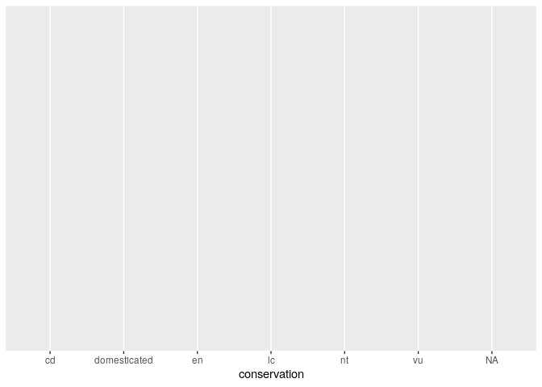
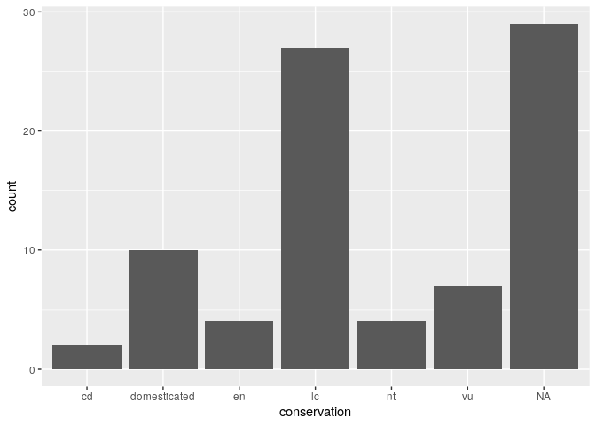
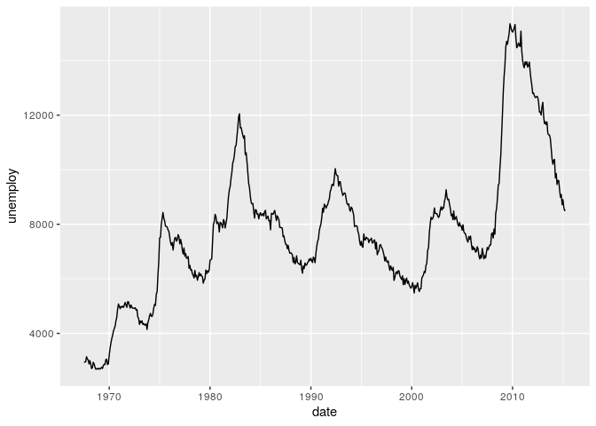
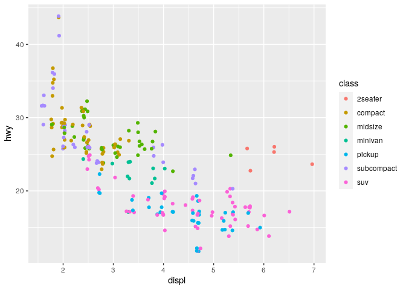
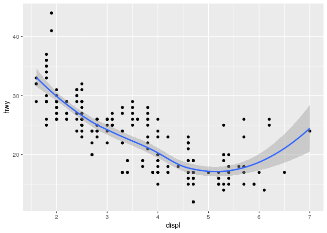
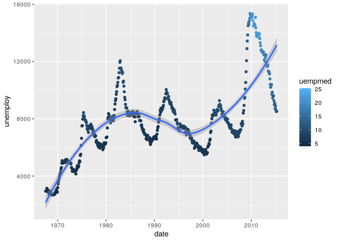
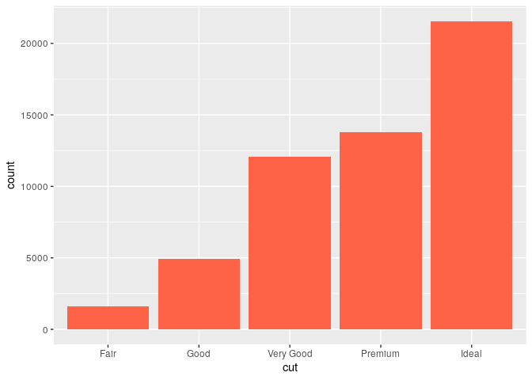
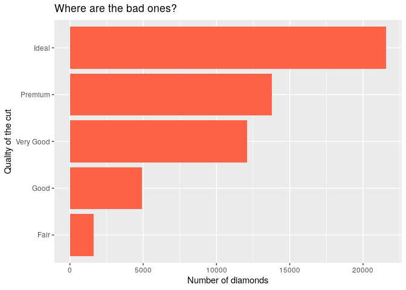

R data visualisation with RStudio and ggplot2: introduction
================
UQ Library
2021-06-11

## Before we start

> If you don’t have both R and RStudio installed, you can use our
> [installation
> instructions](https://gitlab.com/stragu/DSH/blob/master/R/Installation.md).

## What are we going to learn?

This session is directed at R users (a beginner level is sufficient) who
are new to the ggplot2 package.

During this session, you will:

-   Have a visualisation package installed (ggplot2)
-   Learn how to explore data visually
-   Learn about the 3 essential ggplot2 components
-   Use different kinds of visualisations
-   Layer several visualisations
-   Learn how to customise a plot with colours, labels and themes.

## Open RStudio

-   If you are using your own laptop please open RStudio
    -   Make sure you have a working Internet connection
-   On the Library computers (the first time takes about 10 min):
    -   Log in with your UQ username and password (use your student
        account if you have both a staff and student account)
    -   Make sure you have a working Internet connection
    -   Open the ZENworks application
    -   Look for RStudio
    -   Double-click on RStudio which will install both R and RStudio

## Essential shortcuts

Remember some of the most commonly used RStudio shortcuts:

-   function or dataset help: press <kbd>F1</kbd> with your cursor
    anywhere in a function name.
-   execute from script: <kbd>Ctrl</kbd> + <kbd>Enter</kbd>
-   assignment operator (`<-`): <kbd>Alt</kbd> + <kbd>-</kbd>

## Material

### Installing ggplot2

We first need to make sure we have the **ggplot2 package** available on
our computer. We can use the “Install” button in the “Packages” pane, or
we can execute this command in the console:
`install.packages("ggplot2")`

You only need to install a package once, but you need to load it every
time you start a new R session.

### Setting up a project

> Everything we write today will be saved in your R project. Please
> remember to save it on your H drive or USB if you are using a Library
> computer.

Let’s create a new **R project** to keep everything tidy:

-   Click the “File” menu button (top left corner), then “New Project”
-   Click “New Directory”
-   Click “New Project”
-   In “Directory name”, type the name of your project,
    e.g. “ggplot2\_intro”
-   Select the folder where to locate your project: e.g. a
    `Documents/RProjects` folder, which you can create if it doesn’t
    exist yet.
-   Click the “Create Project” button
-   Create a folder to store our plots:
    -   `dir.create("plots")`

We will write ggplot2 code more comfortably in a **script**:

-   Menu: Top left corner, click the green “plus” symbol, or press the
    shortcut (for Windows/Linux)
    <kbd>Ctrl</kbd>+<kbd>Shift</kbd>+<kbd>N</kbd> or (for Mac)
    <kbd>Cmd</kbd>+<kbd>Shift</kbd>+<kbd>N</kbd>. This will open an
    “Untitled1” file.
-   Go to “File &gt; Save” or press (for Windows/Linux)
    <kbd>Ctrl</kbd>+<kbd>S</kbd> or (for Mac)
    <kbd>Cmd</kbd>+<kbd>S</kbd>. This will ask where you want to save
    your file and the name of the new file.
-   Call your file “process.R”

We can straight away **load the package** by adding this command to our
script and executing it:

``` r
library(ggplot2)
```

> Remember to use <kbd>Ctrl</kbd>+<kbd>Enter</kbd> to execute a command
> from the script.

### Finding help

We are going to work with different datasets that come with the ggplot2
package. For any dataset or function doubts that you might have, don’t
forget the two main ways to bring up a help page:

1.  the command: `?functionname`
2.  the keyboard shortcut: press <kbd>F1</kbd> after writing a function
    name

### Introducing ggplot2

The R package ggplot2 was developed by Hadley Wickham with the objective
of creating a grammar of graphics for categorical data (in 2007). It is
based on the book *The Grammar of Graphics* Developed by Leland
Wilkinson (first edition published in 1999).

It is now part of the group of data science packages called Tidyverse.

### The components of the Grammar of Graphics

The Grammar of Graphics is based on the idea that you can build every
graph from the same few components.

The components are:

-   Data
-   Mapping
-   Statistics
-   Scales
-   Geometries
-   Facets
-   Coordinates
-   Theme

In this introductory session, we will mainly focus on the **data**, the
**mapping**, the **statistics**, the **geometries** and the **theme**.

### ggplot2’s three essential components

In ggplot2, the 3 main components that we usually have to provide are:

1.  Where the **data** comes from,
2.  the **aesthetic mappings**, and
3.  a **geometry**.

For our first example, let’s use the `msleep` dataset (from the ggplot2
package), which contains data about mammals’ sleeping patterns.

> You can find out about the dataset with `?msleep`.

Let’s start with specifying where the **data** comes from in the
`ggplot()` function:

``` r
ggplot(data = msleep)
```

<!-- -->

This is not very interesting. We need to tell ggplot2 *what* we want to
visualise, by **mapping** *aesthetic elements* (like our axes) to
*variables* from the data. We want to visualise how common different
conservations statuses are, so let’s associate the right variable to the
x axis:

``` r
ggplot(data = msleep,
       mapping = aes(x = conservation))
```

<!-- -->

ggplot2 has done what we asked it to do: the conservation variable is on
the x axis. But nothing is shown on the plot area, because we haven’t
defined *how* to represent the data, with a `geometry_*` function:

``` r
ggplot(data = msleep,
       mapping = aes(x = conservation)) +
  geom_bar()
```

<!-- -->

Now we have a useful plot: we can see that a lot of animals in this
dataset don’t have a conservation status, and that “least concern” is
the next most common value.

We can see our three essential elements in the code:

1.  the **data** comes from the `msleep` object;
2.  the variable `conservation` is **mapped to the aesthetic** `x`
    (i.e. the x axis);
3.  the **geometry** is `"bar"`, for “bar chart”.

Here, we don’t need to specify what variable is associated to the y
axis, as the “bar” geometry automatically does a count of the different
values in the `conservation` variable. That is what **statistics** are
applied automatically to the data.

> In ggplot2, each geometry has default statistics, so we often don’t
> need to specify which stats we want to use. We could use a `stat_*()`
> function instead of a `geom_*()` function, but most people start with
> the geometry (and let ggplot2 pick the default statistics that are
> applied).

### Scatterplots

Let’s have a look at another dataset: the `economics` dataset from the
US. Learn more about it with `?economics`, and have a peak at its
structure with:

``` r
str(economics)
```

    ## spec_tbl_df [574 × 6] (S3: spec_tbl_df/tbl_df/tbl/data.frame)
    ##  $ date    : Date[1:574], format: "1967-07-01" "1967-08-01" ...
    ##  $ pce     : num [1:574] 507 510 516 512 517 ...
    ##  $ pop     : num [1:574] 198712 198911 199113 199311 199498 ...
    ##  $ psavert : num [1:574] 12.6 12.6 11.9 12.9 12.8 11.8 11.7 12.3 11.7 12.3 ...
    ##  $ uempmed : num [1:574] 4.5 4.7 4.6 4.9 4.7 4.8 5.1 4.5 4.1 4.6 ...
    ##  $ unemploy: num [1:574] 2944 2945 2958 3143 3066 ...

Do you think that unemployment is stable over the years? Let’s have a
look with a scatterplot:

``` r
ggplot(data = economics,
       mapping = aes(x = date,
                     y = unemploy)) + 
    geom_point()
```

<!-- -->

Let’s go through our essential elements once more:

-   The `ggplot()` function initialises a ggplot object. In it, we
    declare the **input data frame** and specify the set of plot
    aesthetics used throughout all layers of our plot;
-   The `aes()` function groups our **mappings of aesthetics to
    variables**;
-   The `geom_<...>()` function specifies what **geometric element** we
    want to use.

Scatterplots are often used to look at the relationship between two
variables. Let’s try it with a new dataset: `mpg` (which stands for
“miles per gallon”), a dataset about fuel efficiency of different models
of cars.

``` r
?mpg
str(mpg)
```

Do you think that big engines use fuel more efficiently than small
engines?

We can focus on two variables:

-   `displ`: a car’s engine size, in litres.
-   `hwy`: a car’s fuel efficiency on the highway, in miles per gallon.

``` r
ggplot(data = mpg,
       mapping = aes(x = displ,
                     y = hwy)) +
    geom_point()
```

<!-- -->

Notice how the points seem to be aligned on a grid? That’s because the
data was rounded. If we want to better visualise the distribution of the
points and avoid overlapping of points, we can use the “jitter” geometry
instead, which gives the points a little shake:

``` r
ggplot(data = mpg,
       mapping = aes(x = displ,
                     y = hwy)) +
    geom_jitter()
```

<!-- -->

The plot shows a negative relationship between engine size (`displ`) and
fuel efficiency (`hwy`). In other words, cars with big engines use more
fuel. Does this confirm or refute your hypothesis about fuel efficiency
and engine size?

However, we can see some outliers. We need to find out more about our
data.

### Adding aesthetics

We can highlight the “class” factor by adding a new aesthetic:

``` r
ggplot(data = mpg,
       mapping = aes(x = displ,
                     y = hwy,
                     colour = class)) +
    geom_jitter()
```

<!-- -->

It seems that two-seaters are more fuel efficient than other cars with a
similar engine size, which can be explained by the lower weight of the
car. The general trend starts to make more sense!

We now know how to create a simple scatterplot, and how to visualise
extra variables. But how can we better represent a correlation?

### Trend lines

A trend line can be created with the `geom_smooth()` function:

``` r
ggplot(mpg,
       aes(x = displ,
           y = hwy)) +
    geom_smooth()
```

    ## `geom_smooth()` using method = 'loess' and formula 'y ~ x'

<!-- -->

> We stopped using the argument names because we know in which order
> they appear: first the data, then the mapping of aesthetics. Let’s
> save ourselves some typing from now on!

The console shows you what function / formula was used to draw the trend
line. This is important information, as there are countless ways to do
that. To better understand what happens in the background, open the
function’s help page and notice that the default value for the `method`
argument is “NULL”. Read up on how it automatically picks a suitable
method depending on the sample size, in the “Arguments” section.

Want a linear trend line instead? Add the argument `method = "lm"` to
your function:

``` r
ggplot(mpg,
       aes(x = displ,
           y = hwy)) +
    geom_smooth(method = "lm")
```

    ## `geom_smooth()` using formula 'y ~ x'

<!-- -->

### Layering

A trend line is usually displayed on top of the scatterplot. How can we
combine several layers? We can string them with the `+` operator:

``` r
ggplot(mpg,
       aes(x = displ,
           y = hwy)) + 
    geom_point() +
    geom_smooth()
```

    ## `geom_smooth()` using method = 'loess' and formula 'y ~ x'

<!-- -->

> The order of the functions matters: the points will be drawn before
> the trend line, which is probably what you’re after.

### The `colour` aesthetic

We can once again add some information to our visualisation by mapping
the `class` variable to the `colour` aesthetic:

``` r
ggplot(mpg,
       aes(x = displ,
           y = hwy)) + 
    geom_point(aes(colour = class)) + 
    geom_smooth()
```

    ## `geom_smooth()` using method = 'loess' and formula 'y ~ x'

<!-- -->

**Challenge 1 – where should aesthetics be defined?**

Take the last plot we created:

``` r
ggplot(mpg,
       aes(x = displ,
           y = hwy)) + 
    geom_point(aes(colour = class)) + 
    geom_smooth()
```

What would happen if you moved the `colour = class` aesthetic from the
geometry function to the `ggplot()` call?

Different geometries can also have their own mappings that overwrite the
defaults. If you place mappings in a geom function, ggplot2 will treat
them as local mappings for the layer. It will use these mappings to
extend or overwrite the global mappings for that layer only. This makes
it possible to display different aesthetics in different layers.

### Saving a plot

Like your visualisation? You can export it with the “Export” menu in the
“Plots” pane.

-   Building a document or a slideshow? You can copy it straight to your
    clipboard, and paste it into it.
-   A PDF is a good, quick option to export an easily shareable file
    with vector graphics. Try for example the “A5” size, the “Landscape”
    orientation, and save it into your “plots” directory.
-   More options are available in the “Save as image…” option. PNG is a
    good compressed format for graphics, but if you want to further
    customise your visualisation in a different program, use SVG or EPS,
    which are vector formats. (Try to open an SVG file in
    [Inkscape](https://inkscape.org/) for example.)

To save the last plot with a command, you can use the `ggsave()`
function:

``` r
ggsave(filename = "plots/horiz_bar.png")
```

This is great to automate the export process for each plot in your
script, but `ggsave()` also has extra options, like setting the DPI,
which is useful for getting the right resolution for a specific use. For
example, to export a plot for your presentation:

``` r
ggsave(filename = "plots/horiz_bar_pres.png", dpi = "screen")
```

**Challenge 2 – add a variable and a smooth line**

Let’s use a similar approach to what we did with the `mpg` dataset.

Take our previous “economics” scatterplot:

``` r
ggplot(economics,
       aes(x = date,
           y = unemploy)) + 
    geom_point()
```

How could we:

1.  Add a trend line for the number of unemployed people
2.  Colour the points according to the median duration of unemployment
    (see `?economics`)

``` r
ggplot(economics,
       aes(x = date,
           y = unemploy)) + 
    geom_point(aes(colour = uempmed)) +
    geom_smooth()
```

    ## `geom_smooth()` using method = 'loess' and formula 'y ~ x'

<!-- -->

> See how the legend changes depending on the type of data mapped to the
> `colour` aesthetic? (i.e. categorical vs continuous)

This “trend line” is not particularly useful. We could make it follow
the data more closely by using the `span` argument. The closer to 0, the
closer to the data the smoother will be:

``` r
ggplot(economics,
       aes(x = date,
           y = unemploy)) + 
    geom_point(aes(colour = uempmed)) +
    geom_smooth(span = 0.1)
```

    ## `geom_smooth()` using method = 'loess' and formula 'y ~ x'

<!-- -->

You can now see why this is called a “smoother”: we can fit a smooth
curve to data that varies a lot.

To further refine our visualisation , we could visualise the
unemployment rate rather than the number of unemployed people, by
calculating it straight into our code:

``` r
ggplot(economics,
       aes(x = date,
           y = unemploy / pop)) + 
    geom_point(aes(colour = uempmed)) +
    geom_smooth(span = 0.1)
```

    ## `geom_smooth()` using method = 'loess' and formula 'y ~ x'

<!-- -->

The [early 1980s
recession](https://en.wikipedia.org/wiki/Early_1980s_recession) now seem
to have had a more significant impact on unemployment than the [Global
Financial
Crisis](https://en.wikipedia.org/wiki/Financial_crisis_of_2007%E2%80%9308)
of 2007-2008.

### Bar charts and ordered factors

Let’s use the `diamonds` dataset now. The `diamonds` dataset comes with
ggplot2 and contains information about \~54,000 diamonds, including the
price, carat, color, clarity, and cut of each diamond.

Let’s have a look at the data:

``` r
diamonds
summary(diamonds)
?diamonds
```

Back to bar charts. Consider a basic bar chart, as drawn with
`geom_bar()`. The following chart displays the total number of diamonds
in the `diamonds` dataset, grouped by cut:

``` r
ggplot(diamonds,
       aes(x = cut)) + 
    geom_bar()
```

<!-- -->

The chart shows that more diamonds are available with high quality cuts
than with low quality cuts.

`cut` is an ordered factor, which you can confirm by printing it to the
console:

``` r
head(diamonds$cut)
```

    ## [1] Ideal     Premium   Good      Premium   Good      Very Good
    ## Levels: Fair < Good < Very Good < Premium < Ideal

See how ggplot2 respects that order in the bar chart?

### Customising a plot

Let’s see how we can customise our bar chart’s look.

#### Change a geometry’s default colour

First, we can pick our favourite colour in `geom_bar()`:

``` r
ggplot(diamonds,
       aes(x = cut)) + 
    geom_bar(fill = "tomato")
```

<!-- -->

If you are curious about what colour names exist in R, you can use the
`colours()` function.

#### Change labels

We can also modify labels with the `labs()` function to make our plot
more self-explanatory:

``` r
ggplot(diamonds,
       aes(x = cut)) + 
    geom_bar(fill = "tomato") +
    labs(title = "Where are the bad ones?",
         x = "Quality of the cut",
         y = "Number of diamonds")
```

<!-- -->

Let’s have a look at what `labs()` can do:

``` r
?labs
```

It can edit the title, the subtitle, the x and y axes labels, and the
caption.

> Remember that captions and titles are better sorted out in the
> publication itself, especially for accessibility reasons (e.g. to help
> with screen readers).

#### Horizontal bar charts

For a horizontal bar chart, we can map the `cut` variable to the `y`
aesthetic instead of `x`. But remember to also change your labels
around!

``` r
ggplot(diamonds,
       aes(y = cut)) + # switch here...
  geom_bar(fill = "tomato") +
  labs(title = "Where are the bad ones?",
       y = "Quality of the cut", # ...but also here!
       x = "Number of diamonds") # ...and here!
```

<!-- -->

This is particularly helpful when long category names overlap under the
x axis.

#### Built-in themes

The `theme()` function allows us to really get into the details of our
plot’s look, but some `theme_*()` functions make it easy to apply a
built-in theme, like `theme_bw()`:

``` r
ggplot(diamonds,
       aes(y = cut)) + 
  geom_bar(fill = "tomato") +
  labs(title = "Where are the bad ones?",
       y = "Quality of the cut",
       x = "Number of diamonds") +
  theme_bw()
```

<!-- -->

Try `theme_minimal()` as well, and if you want more options, install the
`ggthemes` package!

## Play time!

**Challenge 3: explore geometries**

When creating a new layer, start typing `geom_` and see what suggestions
pop up. Are there any suggestions that sound useful or familiar to you?

Modify your plots, play around with different layers and functions, and
ask questions!

## Close project

Closing RStudio will ask you if you want to save your workspace and
scripts. Saving your workspace is usually not recommended if you have
all the necessary commands in your script.

## Useful links

-   For ggplot2:
    -   [ggplot2
        cheatsheet](https://www.rstudio.org/links/data_visualization_cheat_sheet)
    -   Official [ggplot2
        documentation](http://docs.ggplot2.org/current/)
    -   Official [ggplot2 website](http://ggplot2.tidyverse.org/)
    -   [Chapter on data
        visualisation](http://r4ds.had.co.nz/data-visualisation.html) in
        the book *R for Data Science*
    -   Selva Prabhakaran’s [*r-statistics.co* section on
        ggplot2](http://r-statistics.co/ggplot2-Tutorial-With-R.html)
    -   [Coding Club’s data visualisation
        tutorial](https://ourcodingclub.github.io/2017/01/29/datavis.html)
    -   [Cookbook for R graphs](http://www.cookbook-r.com/Graphs/)
    -   [STHDA’s ggplot2
        essentials](http://www.sthda.com/english/wiki/ggplot2-essentials)
-   Our compilation of [general R
    resources](https://gitlab.com/stragu/DSH/blob/master/R/usefullinks.md)
