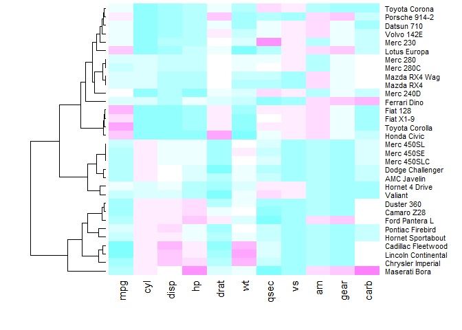
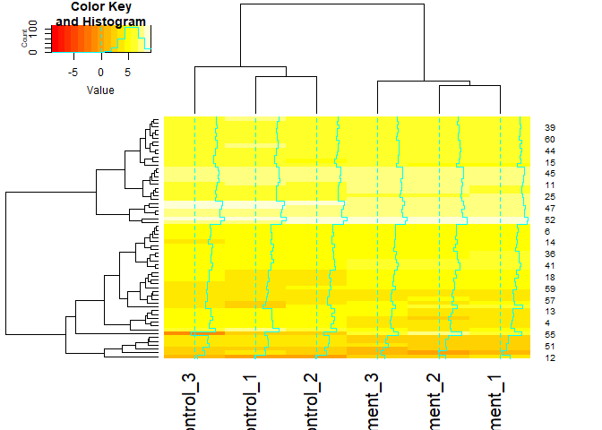
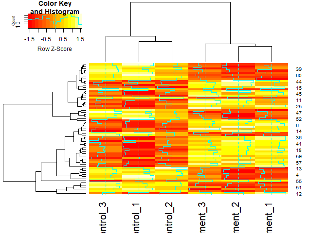
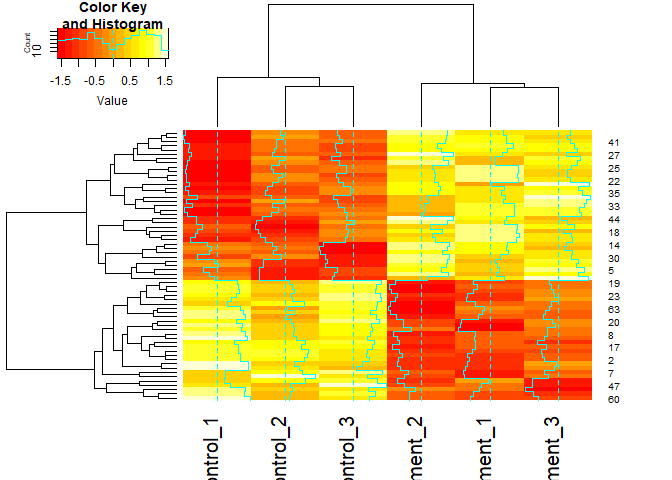
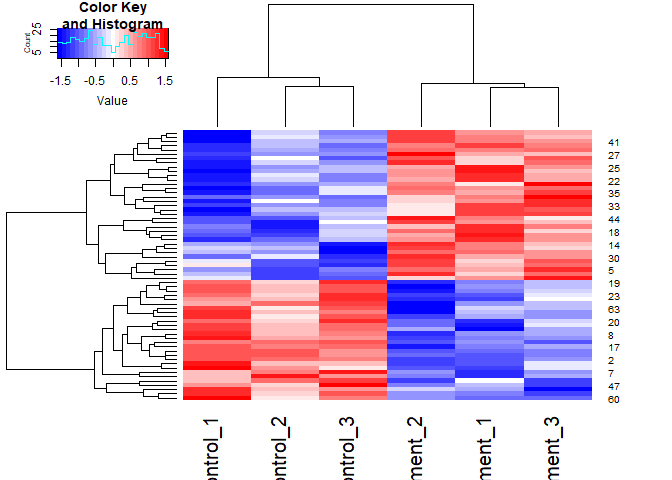

R data visualisation with RStudio: heatmaps
================
2021-09-06

> This document is edited as an R markdown file, and regularly exported
> as a GitHub document. The source code is
> [here](https://gitlab.com/stragu/DSH/blob/master/R/heatmaps_intermediate.Rmd)
> The published printer-friendly version is
> [here](https://gitlab.com/stragu/DSH/blob/master/R/heatmaps/heatmaps_intermediate.md)

## What are we going to learn?

A **heatmap** is a way of visualising a table of numbers, where you
substitute the numbers with colored cells. It’s useful for finding highs
and lows, and see patterns more clearly. There are many functions
available in R to create this kind of visualisations, but we will focus
in four options here.

During this session, you will:

  - Learn how to produce a simple heatmap with the base function
    `heatmap()`;
  - Learn about alternatives to produce more complex heatmaps, like
    `heatmap.2()` and `pheatmap()`;
  - Learn how to produce a rudimentary heatmap with the ggplot2 package.

## Disclaimer

We will assume you are an R intermediate user and that you have used
RStudio before.

## Open RStudio

> If you need the installation instructions:
> <https://gitlab.com/stragu/DSH/blob/master/R/Installation.md>

  - On your own computer:
      - Open RStudio
      - Make sure you have a working internet connection
  - On Library computers:
      - Log in with your UQ username and password
      - Make sure you have a working internet connection
      - Open the ZENworks application
      - Look for the letter “R”
      - Double click on RStudio which will install both R and RStudio

## Essential shortcuts

  - function or dataset help: press <kbd>F1</kbd> with your cursor
    anywhere in a function name.
  - execute from script: <kbd>Ctrl</kbd> + <kbd>Enter</kbd>
  - assignment operator (`<-`): <kbd>Alt</kbd> + <kbd>-</kbd>

## Material

### R Project

Everything we write today will be saved in your script, so please
remember to create your project on your H drive (or USB stick) if you
use the University computers, so you can go back to it after the
session.

  - Create a new project:
      - Click the “New project” menu icon
      - Click “New Directory”
      - Click “New Project”
      - In “Directory name”, type the name of your project,
        e.g. “heatmaps”
      - Browse and select a folder where to locate your project (for
        example, an “r\_projects” directory where all your projects
        live)
      - Click the “Create Project” button
  - Create new folders with the following commands:

<!-- end list -->

``` r
dir.create("scripts")
dir.create("plots")
```

  - Create a new R script called “heatmaps.R” in the “scripts” folder:

<!-- end list -->

``` r
file.create("scripts/heatmaps.R")
file.edit("scripts/heatmaps.R")
```

### Method 1: the base `heatmap()` function

As a first example, we will use a built-in dataset called `mtcars`.

#### Explore the data

``` r
?mtcars
dim(mtcars)
str(mtcars)
head(mtcars)
View(mtcars)
```

#### Prepare data

The data is a dataframe, but it has to be a **numeric matrix** to make
your heatmap. Dataframes can contain variables with different data
classes, whereas matrices only contain one data class.

``` r
class(mtcars)
```

    ## [1] "data.frame"

``` r
mtcars_matrix <- data.matrix(mtcars) # convert a DF to a numeric matrix
class(mtcars_matrix)
```

    ## [1] "matrix" "array"

#### Visualise

We are now going to use the `heatmap()` function to create our first
heatmap:

``` r
heatmap(mtcars_matrix)
```

<!-- -->

Does it look like what you expected?

Look at the function’s help page, and read the description of the
`scale` argument in particular:

``` r
?heatmap
```

    ## starting httpd help server ... done

**Scale** is important: the values should be centered and scaled in
either rows or columns. In our case, we want to visualise highs and lows
in each variable, which are in columns.

``` r
heatmap(mtcars_matrix, scale = "column")
```

<!-- -->

We can now see the high (red) and low (white) values in each variable,
and visualise groups of similar cars.

#### Colours

With versions of R up to 3.5, the default heatmap palette was
`heat.colors()`, which is not the most intuitive as it goes from red for
low values to white for high values.

Since R 3.6, the default palette is “YlOrRd”, which stand for “Yellow,
Orange, Red”.

You can however replace the default palette and use different colours,
and different numbers of levels. For example, in the palette function
`cm.colors(n)`, n is the number of levels (\>= 1) contained in the
cyan-to-magenta palette. This function can be used in the `col`
argument:

``` r
heatmap(mtcars_matrix,
        scale = "column",
        col = cm.colors(n = 15))
```

<!-- -->

You can try other functions, like `terrain.colors()` or `hcl.colors()`
(in R \> 3.6), and you can reverse them with the `rev = TRUE` argument.

#### Remove dendrograms

The column dendrogram doesn’t really make sense for this dataset. `Rowv`
and `Colv` can be set to `NA` to remove dendrograms, which also means
the data won’t be reorganised according to the clustering method.

``` r
heatmap(mtcars_matrix,
        scale = "column",
        col = cm.colors(15),
        Colv = NA)
```

<!-- -->

#### Clean the environment

We can start with a fresh environment, using:

``` r
rm(list = ls())
```

### Method 2: `gplots::heatmap.2()`

If you don’t have the gplots package yet, use
`install.packages("gplots")`.

``` r
library(gplots)
```

    ## Warning: package 'gplots' was built under R version 4.0.5

    ## 
    ## Attaching package: 'gplots'

    ## The following object is masked from 'package:stats':
    ## 
    ##     lowess

``` r
?heatmap.2
```

This gplots heatmap function provides a number of extensions to the
standard R heatmap function.

#### Protein data example

This dataset contains observations for 63 proteins in three control
experiments and three experiments where cells are treated with a growth
factor. We need to import it from the web:

``` r
rawdata <- read.csv("https://raw.githubusercontent.com/ab604/heatmap/master/leanne_testdata.csv")
```

We can then explore the data:

``` r
str(rawdata)
head(rawdata)
View(rawdata)
```

It’s important to note that a lot of visualisations involve gathering
and preparing data. Rarely do you get data exactly how you need it, so
you should expect to do some data munging before producing the visuals.

Here, we need to remove useless columns, and we also want to rename them
for clarity.

``` r
rawdata <- rawdata[ , 2:7] # remove superfluous columns
colnames(rawdata) <- c(paste("Control", 1:3, sep = "_"), 
                       paste("Treatment", 1:3, sep = "_"))
```

We also need to convert the dataframe to a matrix, just like in our
first example.

``` r
class(rawdata)
```

    ## [1] "data.frame"

``` r
data_matrix <- data.matrix(rawdata)
class(data_matrix)
```

    ## [1] "matrix" "array"

We can now visualise the data with `heatmap.2()`:

``` r
heatmap.2(data_matrix)
```

<!-- -->

> The `scale` argument in `heatmap.2()` is by default set to `"none"`\!

For a more informative visualisation, we can scale the data for each
protein:

``` r
heatmap.2(data_matrix,
          scale = "row")
```

<!-- -->

We can now see each protein’s response to treatments.

> Notice how the visualisation is more readable, but the clustering does
> not take into account the scaling? That’s because the scaling is done
> *after* the clustering.

With `heatmap.2()`, if we want to cluster rows according to the scaled
data, we have to scale it *prior* to generating the heatmap.

``` r
?scale
```

`scale()` is a function that centres and scales the *columns* of a
numeric matrix. We **transpose** the matrix with `t()` to then **centre
and scale** each protein’s data (i.e. the rows) with `scale()`. Finally,
we transpose the data back to the original form.

``` r
# Scale and centre data for each protein,
# but transpose first so it operates on rows
data_scaled_t <- scale(t(data_matrix))
# transpose back to original form
data_scaled <- t(data_scaled_t)
```

*Step 6: create heatmaps*

``` r
heatmap.2(data_scaled)
```

<!-- -->

We can now see clear groups.

#### More control over colours

Let’s create a new palette function:

``` r
my_palette <- colorRampPalette(c("blue",
                                 "white",
                                 "red")) # from low to high
```

Now, we can use it and further customise our heatmap:

``` r
heatmap.2(data_scaled,
          trace = "none",               # turn off trace lines from heatmap
          col = my_palette(25))         # use my colour scheme with 25 levels
```

<!-- -->

Fix a few things and add a few extras:

``` r
heatmap.2(data_scaled,
          Colv = NA,                # no clustering on columns
          trace = "none",
          col = my_palette(25),
          main = "A good title",    # add title
          margins = c(6, 4),        # more space from border
          keysize = 2,              # make key and histogram bigger
          cexRow = 0.40,            # amend row font
          cexCol = 0.80)            # amend column font
```

    ## Warning in heatmap.2(data_scaled, Colv = NA, trace = "none", col =
    ## my_palette(25), : Discrepancy: Colv is FALSE, while dendrogram is `both'.
    ## Omitting column dendogram.

<!-- -->

If you want to remove a dendrogram but keep the clustering:

``` r
heatmap.2(data_scaled,
          dendrogram = "row",     # only show the row dendrogram
          trace = "none",
          col = my_palette(25),
          main = "A good title",
          margins = c(6, 4),
          keysize = 2,
          cexRow = 0.40,
          cexCol = 0.80)
```

<!-- -->

Clean up the environment with:

``` r
rm(list = ls())
```

### Method 3: `pheatmap::pheatmap()`

If you don’t have it already, install pheatmap with
`install.packages("pheatmap")`.

Load the required package with:

``` r
library(pheatmap)
```

    ## Warning: package 'pheatmap' was built under R version 4.0.5

How does `pheatmap()` (which stands for “pretty heatmap”) differ from
other functions?

``` r
?pheatmap
```

> A function to draw clustered heatmaps where one has better control
> over some graphical parameters such as cell size, etc.

Create a data matrix from pseudo-random numbers:

``` r
d <- matrix(rnorm(25), 5, 5)
colnames(d) <- paste0("Treatment", 1:5)
rownames(d) <- paste0("Gene", 1:5)
```

Try it out:

``` r
pheatmap(d, 
         main = "Pretty heatmap",
         cellwidth =  50,
         cellheight = 30,
         fontsize = 12,
         display_numbers = TRUE)
```

<!-- -->

> By default, the `scale` argument is set to `"none"`. If you do scale
> the data, the clustering will take it into account (i.e. the
> clustering happens *after* the scaling).

``` r
pheatmap(d, 
         main = "Pretty heatmap",
         cellwidth =  50,
         cellheight = 30,
         fontsize = 12,
         display_numbers = TRUE,
         scale = "row")
```

<!-- -->

You can save your plot with an extra argument:

``` r
pheatmap(d, 
         main = "Pretty heatmap",
         cellwidth =  50,
         cellheight = 30,
         fontsize = 12,
         filename = "plots/heatmap.pdf")
```

Clean up your environment with:

``` r
rm(list = ls())
```

### Summary of first three methods

The first three methods differ in their default settings and in the
order of the processing steps:

    stats::heatmap():     scale (row) -> cluster -> colour
    gplots::heatmap.2():  cluster -> scale (none) -> colour
    pheatmap::pheatmap(): scale (none) -> cluster -> colour

### Method 4: a dataframe in ggplot2

If you want to stick to the ggplot2 package for all your data
visualisation, there is a way to create a simple heatmap (without
clustering). So far, we have seen methods that make use of data
matrices; however, ggplot2 deals with dataframes.

If you don’t have ggplot2 installed on your system, you can do that with
the command `install.packages("ggplot2")`.

Load the necessary library:

``` r
library(ggplot2)
```

    ## Warning: package 'ggplot2' was built under R version 4.0.5

We are using a built-in dataset about oesophageal cancer occurence:
`esoph`.

``` r
?esoph
```

Let’s subset the data we want to look at, i.e. only 55-64 year-olds:

``` r
esoph_sub <- subset(esoph, agegp == "55-64")
```

Create a basic heatmap from the dataframe:

``` r
ggplot(esoph_sub, aes(x = alcgp,
                      y = tobgp,
                      fill = ncases / (ncases + ncontrols))) +
  geom_tile(colour = "white") + # grid colour
  scale_fill_gradient(low = "white",
                      high = "steelblue") +
  theme_minimal() +
  labs(fill = "Cancer freq.",
       x = "Alcohol consumption",
       y = "Tobacco consumption")
```

<!-- -->

This ggplot2 method does not allow to create dendrograms.

Clean up your environment with:

``` r
rm(list = ls())
```

### (optional) Method 5: `ComplexHeatmap::Heatmap`

This extra method come from a different repository than the official
CRAN repositories: the [Bioconductor](https://www.bioconductor.org)
project.

The package we use is the ComplexHeatmap package, which is fully
documented
[here](https://jokergoo.github.io/ComplexHeatmap-reference/book/).

*Step 1: install and load*

BiocManager is used to install Bioconductor packages.

``` r
# install.packages("BiocManager")
# BiocManager::install("ComplexHeatmap")
library(ComplexHeatmap)
```

    ## Loading required package: grid

    ## ========================================
    ## ComplexHeatmap version 2.9.3
    ## Bioconductor page: http://bioconductor.org/packages/ComplexHeatmap/
    ## Github page: https://github.com/jokergoo/ComplexHeatmap
    ## Documentation: http://jokergoo.github.io/ComplexHeatmap-reference
    ## 
    ## If you use it in published research, please cite:
    ## Gu, Z. Complex heatmaps reveal patterns and correlations in multidimensional 
    ##   genomic data. Bioinformatics 2016.
    ## 
    ## The new InteractiveComplexHeatmap package can directly export static 
    ## complex heatmaps into an interactive Shiny app with zero effort. Have a try!
    ## 
    ## This message can be suppressed by:
    ##   suppressPackageStartupMessages(library(ComplexHeatmap))
    ## ========================================
    ## ! pheatmap() has been masked by ComplexHeatmap::pheatmap(). Most of the arguments
    ##    in the original pheatmap() are identically supported in the new function. You 
    ##    can still use the original function by explicitly calling pheatmap::pheatmap().

    ## 
    ## Attaching package: 'ComplexHeatmap'

    ## The following object is masked from 'package:pheatmap':
    ## 
    ##     pheatmap

``` r
library(circlize) # for the colorRamp2() function
```

    ## Warning: package 'circlize' was built under R version 4.0.5

    ## ========================================
    ## circlize version 0.4.13
    ## CRAN page: https://cran.r-project.org/package=circlize
    ## Github page: https://github.com/jokergoo/circlize
    ## Documentation: https://jokergoo.github.io/circlize_book/book/
    ## 
    ## If you use it in published research, please cite:
    ## Gu, Z. circlize implements and enhances circular visualization
    ##   in R. Bioinformatics 2014.
    ## 
    ## This message can be suppressed by:
    ##   suppressPackageStartupMessages(library(circlize))
    ## ========================================

How is the `Heatmap()` function different to the base `heatmap()`?

``` r
?Heatmap
```

*Step 2: create and manipulate data*

Create a data matrix:

> See this [StackOverflow
> article](https://stackoverflow.com/questions/13605271/reasons-for-using-the-set-seed-function)
> on the importance of setting a seed.

``` r
set.seed(123)
mat <- cbind(rbind(matrix(rnorm(16, -1), 4),
                   matrix(rnorm(32, 1), 8)),
             rbind(matrix(rnorm(24, 1), 4),
                   matrix(rnorm(48, -1), 8)))
```

Permute the rows and columns:

``` r
mat <- mat[sample(nrow(mat),
                  nrow(mat)),
           sample(ncol(mat),
                  ncol(mat))]
rownames(mat) <- paste0("R", 1:12)
colnames(mat) <- paste0("C", 1:10)
```

*Step 3: make a heatmap*

``` r
Heatmap(mat)
```

<!-- -->

Modify the colour and the labels, remove dendrograms (and don’t cluster
the data):

``` r
Heatmap(mat, 
        col = colorRamp2(c(-3, 0, 3),
                         c("brown", "white", "yellow")), 
        cluster_rows = FALSE, 
        cluster_columns = FALSE,
        heatmap_legend_param = list(title = "Values"))
```

<!-- -->

The `cluster_` arguments can take external clustering information, which
means you can use any type of clustering method.

Now, let’s see how this function deals with missing values:

``` r
mat_with_na <- mat
mat_with_na[sample(c(TRUE, FALSE),
                   nrow(mat)*ncol(mat),
                   replace = TRUE,
                   prob = c(1, 9))] <- NA
Heatmap(mat_with_na, 
        col = topo.colors(100),
        na_col = "orange", 
        clustering_distance_rows = "pearson",
        heatmap_legend_param = list(title = "Values"))
```

    ## Warning: NA exists in the matrix, calculating distance by removing NA values.

<!-- -->

`Heatmap()` automatically removes NA values to calculate the distance.

We can also reorganise dendrograms and labels:

``` r
Heatmap(mat, 
        name = "abundance", 
        row_names_side = "left", 
        row_dend_side = "right", 
        column_names_side = "top", 
        column_dend_side = "bottom")
```

<!-- -->

To separate clusters, we can use the `km` argument, which allows k-means
clustering on rows.

``` r
Heatmap(mat, 
        name = "abundance", 
        row_names_side = "left", 
        row_dend_side = "right", 
        column_names_side = "top", 
        column_dend_side = "bottom",
        km = 2)
```

<!-- -->

We can add options, save the base plot as an object and then slightly
modify if with the `draw()` function:

``` r
h1 <- Heatmap(mat, 
        name = "abundance", 
        col = topo.colors(50),
        color_space = "sRGB",
        row_dend_width = unit(1, "cm"),
        column_dend_height = unit(1, "cm"),
        row_dend_reorder = TRUE,
        column_dend_reorder = TRUE,
        row_names_gp = gpar(fontsize = 7),
        column_names_gp = gpar(fontsize = 9),
        column_names_max_height = unit(2, "cm"),
        row_names_max_width = unit(9, "cm"),
        column_title = "This is a complex heatmap")
draw(h1, heatmap_legend_side = "left")
```

<!-- -->

Clean my environment with:

``` r
rm(list = ls())
```

## Close R project

When closing RStudio, you should be prompted to save your workspace. If
your script contains all the steps required to generate your data and
visualisations, it is best practice to not save your workspace: you can
execute the whole script when you go back to your project.

## Important links

  - For heatmaps:
      - a more in-depth example with pheatmap:
        <http://slowkow.com/notes/pheatmap-tutorial/>
      - Leanne Wicken’s dataset with heatmap.2 and an interactive
        heatmap with d3heatmap: <https://rpubs.com/ab604/98032>
      - a heatmap gallery: <https://www.r-graph-gallery.com/heatmap>
  - More heatmap packages:
      - Full reference on **ComplexHeatmap**:
        <https://jokergoo.github.io/ComplexHeatmap-reference/book/>
      - **tidyHeatmap**, built on ComplexHeatmap but for tidy data:
        <https://github.com/stemangiola/tidyHeatmap#tidyheatmap>
      - **iheatmapr**, for richer interactive heatmaps:
        <https://docs.ropensci.org/iheatmapr/>
  - Our compilation of R resources:
    <https://gitlab.com/stragu/DSH/blob/master/R/usefullinks.md>
