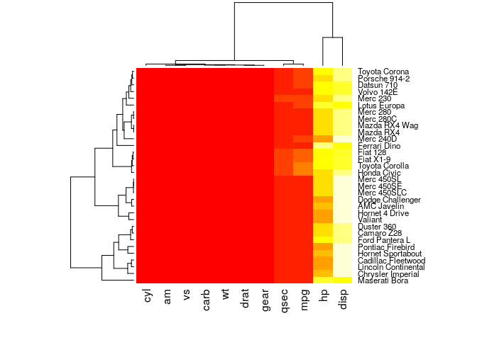
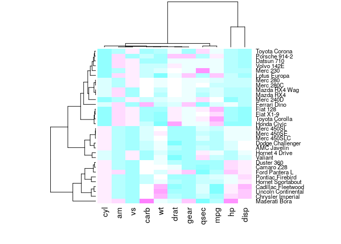
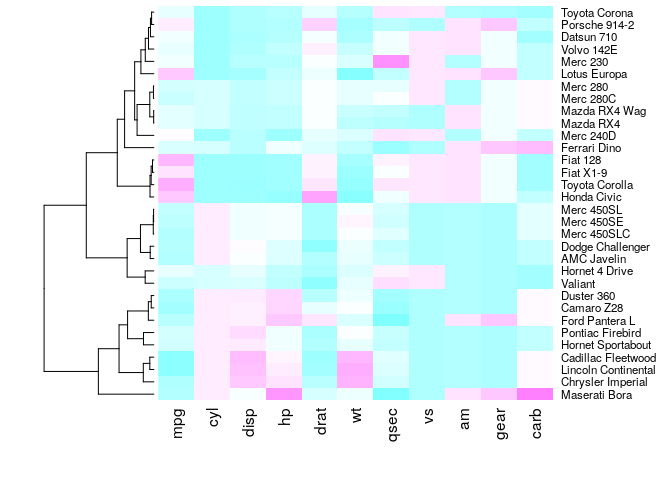
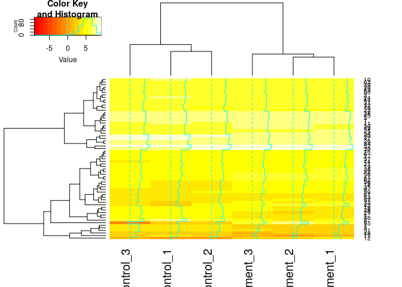
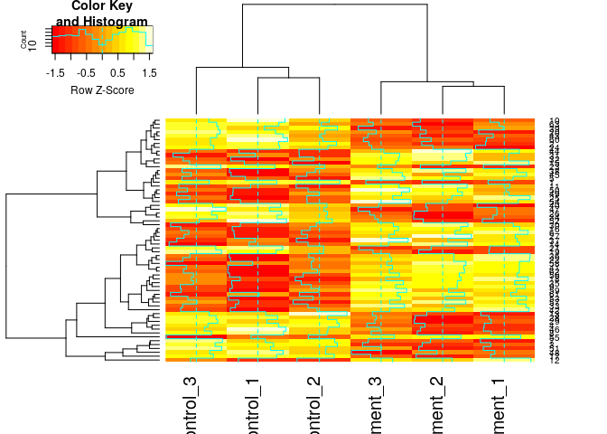

R data visualisation with RStudio: heatmaps
================
2018-11-02

> This document is edited as an R markdown file, and regularly exported as a GitHub document. The source code is [here](https://gitlab.com/stragu/CDS/blob/master/R/heatmaps_intermediate.Rmd) The published printer-friendly version is [here](https://gitlab.com/stragu/CDS/blob/master/R/heatmaps/heatmaps_intermediate.md)

If you want to review the installation instructions: <https://gitlab.com/stragu/CDS/blob/master/R/Installation.md>

Everything we write today will be saved in your R Project. Please remember to save it in your H drive or USB if you use the University computers.

Keep in mind
------------

-   Case sensitive
-   No spaces in names
-   Use <kbd>Ctrl</kbd>+<kbd>Enter</kbd> to run a command, and <kbd>Ctrl</kbd>+<kbd>Shift</kbd> to make your code more readable.

Open RStudio
------------

-   On your own laptop:
    -   Open RStudio
    -   Make sure you have a working internet connection
-   On Library computers:
    -   Log in with your UQ username and password
    -   Make sure you have a working internet connection
    -   Open the ZENworks application
    -   Look for the letter "R"
    -   Double click on RStudio which will install both R and RStudio

What are we going to learn?
---------------------------

During this session, you will:

-   Learn how to produce a simple heatmap with the base function `heatmap()`;
-   Learn about alternatives to produce more complex heatmaps, like `heatmap.2()` and `pheatmap()`;
-   Learn how to produce a rudimentary heatmap with the `ggplot2` package.

A **heatmap** is a way of visualising a table of numbers, where you substitute the numbers with colored cells. It’s useful for finding highs and lows, and see patterns more clearly.

Disclaimer
----------

We will assume you are an R intermediate user and that you have used RStudio before.

Material
--------

### RStudio Project

**Exercise 1 - Setting up a new RStudio Project**

-   Create a new project:
    -   Click the "New project" menu icon
    -   Click "New Directory"
    -   Click "New Project" ("New empty project" if you have an older version of RStudio)
    -   In Directory name type the name of your project, e.g. "heatmaps" (Browse and select a folder where to locate your project, in our case the RProjects folder. If you don't have an RProjects folder, create it.)
    -   Click the "Create Project" button
-   Create new folders with the following commands:

``` r
dir.create("scripts")
dir.create("plots")
```

-   Create a new R script called "heatmaps.R" in the "scripts" folder:

``` r
file.create("scripts/heatmaps.R")
file.edit("scripts/heatmaps.R")
```

### Method 1: the base `heatmap()` function

As a first example, we will use a built-in dataset called `mtcars`.

*Step 1: explore the data*

``` r
?mtcars
dim(mtcars)
str(mtcars)
head(mtcars)
View(mtcars)
```

*Step 2: prepare data*

The data is a dataframe, but it has to be a **numeric matrix** to make your heatmap. Dataframes can contain variables with different data classes, whereas matrices only contain one data class.

**Exercise 2 – Convert the mtcars data into a matrix**

``` r
class(mtcars)
```

    ## [1] "data.frame"

``` r
mtcars_matrix <- data.matrix(mtcars) # convert a DF to a numeric matrix
class(mtcars_matrix)
```

    ## [1] "matrix"

*Step 3: make a heatmap*

We are going to use the `heatmap()` function.

**Exercise 3 – look for the `heatmap()` help**

Read the description of the `scale` argument in particular.

``` r
?heatmap
```

Create a first heatmap:

``` r
heatmap(mtcars_matrix)
```



**Scale** is important: the values should be centered and scaled in either rows or columns. In our case, the variables are contained in columns.

``` r
heatmap(mtcars_matrix, scale = "column")
```


#### Colours

The default heatmap palette, `heat.colors()`, goes from red for low values to white for high values. You can however replace the default palette and use different colours, and different numbers of levels.

For example, in the palette function `cm.colors(n)`, n is the number of levels (&gt;= 1) contained in the cyan-to-magenta palette. It can be used in the `col` argument.

``` r
heatmap(mtcars_matrix,
        scale = "column",
        col = cm.colors(n = 15))
```



You can try other functions, like `rainbow()` or `terrain.colors()`, and you can reverse them with `rev()`.

#### Remove dendrograms

The column dendrogram doesn't really make sense for this dataset. `Rowv` and `Colv` can be set to `NA` to remove dendrograms, which also means the data won't be reorganised according to the clustering method.

``` r
heatmap(mtcars_matrix,
        scale = "column",
        col = cm.colors(100),
        Colv = NA)
```



#### Clean the environment

We can start with a fresh environment, using:

``` r
rm(list = ls())
```

### Method 2: `gplots::heatmap.2()`

If you don't have the `gplots` package yet, use `install.packages("gplots")`.

``` r
library(gplots)
```

    ## 
    ## Attaching package: 'gplots'

    ## The following object is masked from 'package:stats':
    ## 
    ##     lowess

``` r
?heatmap.2
```

This `gplots` heatmap function provides a number of extensions to the standard R heatmap function.

#### Protein data example

*Step 1: import data*

The dataset contains observations for 63 proteins in three control experiments and three experiments where cells are treated with a growth factor. We need to import it from the Internet:

``` r
rawdata <- read.csv("https://raw.githubusercontent.com/ab604/heatmap/master/leanne_testdata.csv")
```

*Step 2: explore the data*

``` r
str(rawdata)
head(rawdata)
View(rawdata)
```

*Step 3: data munging*

It’s important to note that a lot of visualisations involve gathering and preparing data. Rarely do you get data exactly how you need it, so you should expect to do some data munging before producing the visuals.

``` r
rawdata <- rawdata[ , 2:7] # remove superfluous columns
colnames(rawdata) <- c(paste("Control", 1:3, sep = "_"), 
                       paste("Treatment", 1:3, sep = "_"))
```

*Step 4: convert the dataframe into a matrix*

``` r
class(rawdata)
```

    ## [1] "data.frame"

``` r
data_matrix <- data.matrix(rawdata)
class(data_matrix)
```

    ## [1] "matrix"

We can now visualise the data with `heatmap.2()`:

``` r
heatmap.2(data_matrix)
```



> The `scale` argument in `heatmap.2()` is by default set to `"none"`!

For a more informative visualisation, we can scale the data for each protein:

``` r
heatmap.2(data_matrix,
          scale = "row")
```



We can now see each protein's response to treatments.

> Notice how the visualisation is more readable, but the clustering does not take into account the scaling? That's because the scaling is done *after* the clustering.

*Step 5: pre-scale the dataset*

If we want to cluster rows according to the scaled data, we have to scale it *prior* to generating the heatmap.

``` r
?scale
```

`scale()` is a function that centres and scales the *columns* of a numeric matrix. We **transpose** the matrix with `t()` to then **centre and scale** each protein's data (i.e. the rows) with `scale()`. Finally, we transpose the data back to the original form.

``` r
# Scale and centre data for each protein,
# but transpose first so it operates on rows
data_scaled_t <- scale(t(data_matrix))
# transpose back to original form
data_scaled <- t(data_scaled_t)
```

*Step 6: create heatmaps*

``` r
heatmap.2(data_scaled)
```


We can now see clearer groups.

#### More control over colours

Let's create a new palette function:

``` r
my_palette <- colorRampPalette(c("blue",
                                 "white",
                                 "red")) # from low to high
```

Now, we can use it and further customise our heatmap:

``` r
heatmap.2(data_scaled,
          trace = "none",               # turn off trace lines from heatmap
          col = my_palette(25))         # use my colour scheme with 25 levels
```


Fix a few things and add a few extras:

``` r
heatmap.2(data_scaled,
          Colv = NA,                # no clustering on columns
          trace = "none",
          col = my_palette(25),
          main = "A good title",    # add title
          margins = c(6, 4),        # more space from border
          keysize = 2,              # make key and histogram bigger
          cexRow = 0.40,            # amend row font
          cexCol = 0.80)            # amend column font
```

    ## Warning in heatmap.2(data_scaled, Colv = NA, trace = "none", col =
    ## my_palette(25), : Discrepancy: Colv is FALSE, while dendrogram is `both'.
    ## Omitting column dendogram.


If you want to remove a dendrogram but keep the clustering:

``` r
heatmap.2(data_scaled,
          dendrogram = "row",     # only show the row dendrogram
          trace = "none",
          col = my_palette(25),
          main = "A good title",
          margins = c(6, 4),
          keysize = 2,
          cexRow = 0.40,
          cexCol = 0.80)
```


Clean up the environment with:

``` r
rm(list = ls())
```

### Method 3: `pheatmap()`

If you don't have it already, install `pheatmap` with `install.packages("pheatmap")`.

Load the required package with:

``` r
library(pheatmap)
```

How does `pheatmap` (which stands for "pretty heatmap") differ from other functions?

``` r
?pheatmap
```

> A function to draw clustered heatmaps where one has better control over some graphical parameters such as cell size, etc.

Create a data matrix from pseudo-random numbers:

``` r
d <- matrix(rnorm(25), 5, 5)
colnames(d) <- paste0("Treatment", 1:5)
rownames(d) <- paste0("Gene", 1:5)
```

Try it out:

``` r
pheatmap(d, 
         main = "Pretty heatmap",
         cellwidth =  50,
         cellheight = 30,
         fontsize = 12,
         display_numbers = TRUE)
```


> By default, the `scale` argument is set to `"none"`. If you do scale the data, the clustering will take it into account (i.e. the clustering happens *after* the scaling).

``` r
pheatmap(d, 
         main = "Pretty heatmap",
         cellwidth =  50,
         cellheight = 30,
         fontsize = 12,
         display_numbers = TRUE,
         scale = "row")
```


You can save your plot with an extra argument:

``` r
pheatmap(d, 
         main = "Pretty heatmap",
         cellwidth =  50,
         cellheight = 30,
         fontsize = 12,
         filename = "plots/heatmap.pdf")
```

Clean up your environment with:

``` r
rm(list = ls())
```

### Method 4: a dataframe in `ggplot2`

If you want to stick to the `ggplot2` package for all your data visualisation, there is a way to create a simple heatmap. So far, we have seen methods that make use of data matrices; however, `ggplot2` deals with dataframes.

If you don't have `ggplot2` installed on your system, you can do that with the command `install.packages("ggplot2")`.

Load the necessary library:

``` r
library(ggplot2)
```

We are using a built-in dataset about oesophageal cancer occurence: `esoph`.

``` r
?esoph
```

Let's subset the data we want to look at, i.e. only 55-64 year-olds:

``` r
esoph_sub <- subset(esoph, agegp == "55-64")
```

Create a basic heatmap from the dataframe:

``` r
ggplot(esoph_sub, aes(x = alcgp,
                      y = tobgp,
                      fill = ncases / (ncases + ncontrols))) +
  geom_tile(colour = "white") + # grid colour
  scale_fill_gradient(low = "white",
                      high = "steelblue") +
  theme_minimal() +
  labs(fill = "Cancer freq.",
       x = "Alcohol consumption",
       y = "Tobacco consumption")
```


This ggplot2 method does not allow to create dendrograms.

Clean up your environment with:

``` r
rm(list = ls())
```

### (optional) Method 5: `ComplexHeatmap::Heatmap`

URL: <https://www.bioconductor.org/packages/devel/bioc/vignettes/ComplexHeatmap/inst/doc/s2.single_heatmap.html>

*Step 1: install and load*

``` r
# source("https://bioconductor.org/biocLite.R")
# biocLite("ComplexHeatmap") 
library(ComplexHeatmap)
```

    ## Loading required package: grid

    ## ========================================
    ## ComplexHeatmap version 1.20.0
    ## Bioconductor page: http://bioconductor.org/packages/ComplexHeatmap/
    ## Github page: https://github.com/jokergoo/ComplexHeatmap
    ## Documentation: http://bioconductor.org/packages/ComplexHeatmap/
    ## 
    ## If you use it in published research, please cite:
    ## Gu, Z. Complex heatmaps reveal patterns and correlations in multidimensional 
    ##   genomic data. Bioinformatics 2016.
    ## ========================================

``` r
library(circlize)
```

    ## ========================================
    ## circlize version 0.4.5
    ## CRAN page: https://cran.r-project.org/package=circlize
    ## Github page: https://github.com/jokergoo/circlize
    ## Documentation: http://jokergoo.github.io/circlize_book/book/
    ## 
    ## If you use it in published research, please cite:
    ## Gu, Z. circlize implements and enhances circular visualization 
    ##   in R. Bioinformatics 2014.
    ## ========================================

How is the `Heatmap()` function different to the base `heatmap()`?

``` r
?Heatmap
```

*Step 2: create and manipulate data*

Create a data matrix:

``` r
set.seed(123)
mat <- cbind(rbind(matrix(rnorm(16, -1), 4),
                   matrix(rnorm(32, 1), 8)),
             rbind(matrix(rnorm(24, 1), 4),
                   matrix(rnorm(48, -1), 8)))
```

Permute the rows and columns

``` r
mat <- mat[sample(nrow(mat),
                  nrow(mat)),
           sample(ncol(mat),
                  ncol(mat))]
rownames(mat) <- paste0("R", 1:12)
colnames(mat) <- paste0("C", 1:10)
```

*Step 3: make a heatmap*

``` r
Heatmap(mat)
```


Modify the colour and the labels, remove dendrograms (and don't cluster the data):

``` r
Heatmap(mat, 
        col = colorRamp2(c(-3, 0, 3),
                         c("brown", "white", "yellow")), 
        cluster_rows = FALSE, 
        cluster_columns = FALSE,
        heatmap_legend_param = list(title = "Values"))
```


The `cluster_` arguments can take external clustering information, which means you can use any type of clustering method.

Now, let's see how this function deals with missing values:

``` r
mat_with_na <- mat
mat_with_na[sample(c(TRUE, FALSE),
                   nrow(mat)*ncol(mat),
                   replace = TRUE,
                   prob = c(1, 9))] <- NA
Heatmap(mat_with_na, 
        col = topo.colors(100),
        na_col = "orange", 
        clustering_distance_rows = "pearson",
        heatmap_legend_param = list(title = "Values"))
```

    ## Warning in get_dist(submat, distance): NA exists in the matrix, calculating
    ## distance by removing NA values.


`Heatmap()` automatically removes NA values to calculate the distance.

We can also reorganise dendrograms and labels:

``` r
Heatmap(mat, 
        name = "abundance", 
        row_names_side = "left", 
        row_dend_side = "right", 
        column_names_side = "top", 
        column_dend_side = "bottom")
```


To separate clusters, we can use the `km` argument, which allows k-means clustering on rows.

``` r
Heatmap(mat, 
        name = "abundance", 
        row_names_side = "left", 
        row_dend_side = "right", 
        column_names_side = "top", 
        column_dend_side = "bottom",
        km = 2)
```


We can add options, save the base plot as an object and then slightly modify if with the `draw()` function:

``` r
h1 <- Heatmap(mat, 
        name = "abundance", 
        col = topo.colors(50),
        color_space = "sRGB",
        row_dend_width = unit(1, "cm"),
        column_dend_height = unit(1, "cm"),
        row_dend_reorder = TRUE,
        column_dend_reorder = TRUE,
        row_names_gp = gpar(fontsize = 7),
        column_names_gp = gpar(fontsize = 9),
        column_names_max_height = unit(2, "cm"),
        row_names_max_width = unit(9, "cm"),
        column_title = "This is a complex heatmap")
draw(h1, heatmap_legend_side = "left")
```


Clean my environment with:

``` r
rm(list = ls())
```

Close Rproject
--------------

When closing RStudio, you should be prompted to save your workspace.

Important links
---------------

-   RStudio Cheatsheet <https://github.com/rstudio/cheatsheets/raw/master/rstudio-ide.pdf>
-   RStudio online learning <https://www.rstudio.com/online-learning/>
-   Basic and advanced manuals <https://cran.r-project.org/manuals.html>
-   Ask about any function or package <http://www.rdocumentation.org/>
-   If you are looking how-to's or how to fix an error <http://stackoverflow.com/questions/tagged/r>
-   Lynda.com R training and tutorials <https://www.lynda.com/R-training-tutorials/1570-0.html> remember to sign in with your organisational portal,<https://web.library.uq.edu.au/library-services/training/lyndacom-online-courses>
-   R colours <http://www.stat.columbia.edu/~tzheng/files/Rcolor.pdf>
-   Book: Hadley Wickham. ggplot2 Elegant Graphics for Data Analysis Second Edition. 2016 <https://link-springer-com.ezproxy.library.uq.edu.au/content/pdf/10.1007%2F978-3-319-24277-4.pdf>
-   Examples of heatmaps: <https://flowingdata.com/2010/01/21/how-to-make-a-heatmap-a-quick-and-easy-solution/> <https://rpubs.com/ab604/98032> <https://stackoverflow.com/questions/15505607/diagonal-labels-orientation-on-x-axis-in-heatmaps> <https://www.bioconductor.org/packages/devel/bioc/vignettes/ComplexHeatmap/inst/doc/s2.single_heatmap.html>

-   If you need an R and/or RStudio workshop/session, please contact Centre for Digital Scholarship staff to organise one for you. <https://web.library.uq.edu.au/locations-hours/centre-digital-scholarship>
